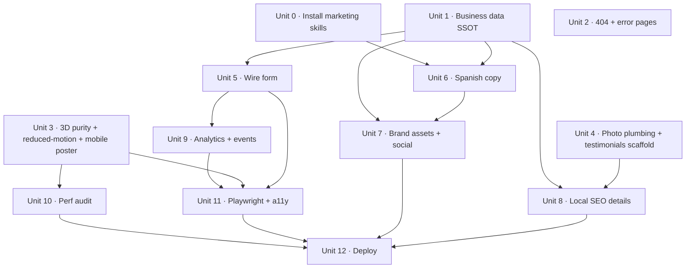

# feat: Uvita Body Shop production readiness

## Overview

Close every gap between the current site at `/home/marcelo/Work/uvitabodyshop.com/` and the proposal promised to Fabricio Ríos Ortiz (₡447.000, 4-week delivery). Fulfill the unfulfilled proposal commitments, ship the credibility details a local business needs, meet Core Web Vitals budgets, install the missing marketing skills, and deploy to production with working SSL at `https://uvitabodyshop.com`.

This plan converts 24 requirements from the brainstorm into 13 sequenced implementation units grouped into seven phases. Each unit has concrete files, test scenarios, and verification outcomes.

## Problem Frame

The site has strong agentic scaffolding (43 skills, JSON-LD, OG metadata, robots, sitemap, llms.txt, typed quote-request API). But: the quote form does not post, content is in English, images are stock placeholders, brand assets are missing, 19 React 19 compiler lint errors block CI green, and nothing is deployed. Without this plan's work, the client pays ₡447.000 for a site that can't capture a lead.

See origin: `docs/brainstorms/2026-04-23-prod-readiness-requirements.md`.

## Requirements Trace

From the origin document. Stable IDs preserved.

**Proposal completion:** R1 form wiring · R2 Spanish copy · R3 real photography plumbing.

**Critical non-proposal gaps:** R4 OG image · R5 favicon/logo · R6 business-data SSOT · R7 3D lint-error fixes · R8 not-found/error pages.

**Performance and reliability:** R9 Core Web Vitals budgets · R10 3D mobile optimization · R11 image optimization · R12 prefers-reduced-motion.

**Local SEO / credibility:** R13 GBP alignment · R14 map · R15 hours indicator · R16 social links & `sameAs` · R17 testimonials/gallery.

**Analytics:** R18 Vercel Web Analytics · R19 conversion events · (R20 error monitoring deferred).

**Skills and workflow:** R21 install missing marketing skills · R22 Playwright smoke tests.

**Deployment:** R23 Vercel project + domain · R24 env vars.

## Scope Boundaries

Carried forward from origin:
- **Out of scope:** blog, customer login, booking calendar, online payment, multi-language toggle, dark/light toggle, CMS, mobile app.
- **Deferred:** error monitoring (R20), photo upload to storage, email notifications, programmatic SEO.
- **Operational only (no code):** domain purchase (tracked in R23 but actual transaction is operational), hosting subscription, 30-day post-launch support.

## Context & Research

### Relevant Code and Patterns

- `src/components/home/HomePage.tsx` — 834-line single-component implementation. Form lives around line 739, contact section at `id="contact"` line 677, services section at `id="services"` line 385. Import list currently reads `contactInfo`, `services`, `processSteps` from `@/data/content` — will point to `business.ts` after Unit 1.
- `src/components/3d/CarPaintScene.tsx` — hero scene. Math.random() at lines 117–123, camera mutation at lines 162–164. Targets of Unit 3.
- `src/components/3d/SprayParticleScene.tsx` — secondary scene. Same purity violation pattern, lines 24–28, plus mobile-size hook at lines 137–141.
- `src/components/ui/{Navigation,ReactiveGrid,HeroSpotlight}.tsx` — shared UI. Navigation likely needs wordmark + sameAs footer edits.
- `src/lib/gsap.ts` — GSAP + ScrollTrigger registration. Reduced-motion wrapping belongs here per AGENTS.md §6.
- `src/data/business.ts` — the new single source of truth (added in setup phase). Already exports `business`, `siteUrl`, `buildStructuredData()`. Will be extended with `sameAs`, `socialLinks`, `mapEmbed`, and optional `testimonials`.
- `src/data/content.ts` — display-level data still used by `HomePage.tsx`. Target for Spanish rewrite (Unit 6) and partial de-duplication (Unit 1).
- `src/app/api/quote-request/route.ts` — typed edge endpoint. Already validates and returns `{ ok, message, contactUrl }`. Form wiring (Unit 5) consumes this unchanged.
- `src/app/{robots,sitemap}.ts`, `src/app/layout.tsx` — metadata surface. `layout.tsx` metadata already references `/og.jpg`; Unit 8 creates the asset.
- `public/.well-known/openapi.yaml` — public API contract. Frozen. Any API change requires OpenAPI update first.
- `public/llms.txt` / `public/llms-full.txt` — already shipped; mentioned for awareness only.

### Institutional Learnings

- **GSAP reveal rule (memory).** Never use `gsap.from()` with ScrollTrigger for opacity reveals — the initial style flashes visible before hydration. Always use CSS initial state (`opacity: 0`) + `gsap.to({ opacity: 1 })`. Applies to Unit 5 (any new submit-state reveal) and Unit 12 (map section entry).
- **Proposal-base reference (memory).** Exploration-phase snapshot is read-only at `/home/marcelo/Work/proposal-base/uvita-bodyshop/`. Do not import from that path; do not push cleanup commits into it.
- **React 19 compiler purity.** The lint errors in 3D scenes are not false positives — they encode a real invariant. Math.random() in render can produce unstable output under Suspense retries or Server Components. Fix via memoized seeded PRNG, not by suppressing the rule.

### External References

Not fetched. Local patterns are strong enough for this plan. The `gsap-performance`, `fixing-motion-performance`, `r3f-fundamentals`, and `frontend-design` skills (already installed) will guide implementation.

## Key Technical Decisions

1. **v1 quote form accepts photo URLs only; no file upload.** Keeps `/api/quote-request` edge-runtime compatible with no storage adapter. If users want to share photos, the WhatsApp deep-link they land on after submit is the natural place. File-upload path revisits in a v2 spike.
2. **Seeded PRNG for 3D particle layout.** Pattern: `src/lib/random.ts` exports a `mulberry32(seed)` factory. Each scene defines a `const SEED = 0xc0ffee` (or similar memorable constant) at module scope, then computes offsets inside `useMemo` using a single RNG instance. Deterministic, pure, passes React 19 compiler rule, stable across SSR/CSR.
3. **3D camera control via `useFrame` and imperative refs, not mutating `useThree`'s `camera`.** Pattern: wrap responsive camera math in a child `<CameraRig />` component that uses `useThree(({ size }) => size)` for dimensions + `useFrame(({ camera }) => ...)` for imperative updates. React 19 compiler treats this as a read-only access.
4. **Spanish-only site, no language switcher.** Confirmed from origin. `<html lang="es">` stays. All user-facing strings in Spanish.
5. **Street address kept private; city/region only in JSON-LD.** `addressLocality: "Uvita"`, `addressRegion: "Puntarenas"` without `streetAddress`. Google LocalBusiness ranking works without a street for small businesses using GBP anchoring.
6. **Vercel Web Analytics, not GA4.** Zero-config via `@vercel/analytics/next`, no cookie banner, DNT respected, lives on the hosting we already use.
7. **Add-on skills installed project-local.** Continues the setup-phase pattern. `-y` flag, no `-g`.
8. **Testimonials UI scaffolded now, content deferred.** `business.ts` exports `testimonials: Testimonial[]`. When empty, the gallery section hides. Ready to receive client-provided photos without an additional PR.
9. **No insurance wording, anywhere.** Client does not work with insurance. Removed from copy in Unit 6. Added to a lightweight copy-review checklist.

## Open Questions

### Resolved During Planning

- **Photo upload in v1?** No — accept URL strings only; defer binary upload.
- **RNG pattern for 3D purity fix?** Seeded `mulberry32` in `src/lib/random.ts`, one const seed per scene.
- **Camera mutation fix?** Move into `CameraRig` child using `useFrame`.
- **Street address in JSON-LD?** No — city/region only.
- **Photo source for R3/R17?** Wait for client. Scaffold now with clearly-marked `TODO: photo` placeholders that map to a single entry in `business.ts` so swap is one edit per slot.
- **Insurance messaging policy?** Removed completely.

### Deferred to Implementation

- **LCP/CLS/INP measured baseline.** Needed before deciding if Unit 8 mobile poster fallback is mandatory or optional. Measured inside Unit 10 on the existing 3D scenes.
- **Exact Facebook / Instagram / GBP URLs.** Client-provided. Unit 7 ships with empty `sameAs` + placeholder icons; editing one file when URLs arrive flips everything through JSON-LD and footer.
- **Domain ownership.** Client intake confirmed GBP exists but does not confirm who owns `uvitabodyshop.com`. Unit 13 pre-work: ask client; if they don't own it, register via Vercel or Cloudflare.
- **Testimonial copy.** Gated on photo delivery and client sign-off.
- **Final OG art direction.** Unit 6 produces a DESIGN.md-compliant default; iterate if client has a logo variant preference.

## High-Level Technical Design

> *This illustrates the intended approach and is directional guidance for review, not implementation specification. The implementing agent should treat it as context, not code to reproduce.*

### Unit dependency graph



### Form submission flow (Unit 5)

```
User fills #contact form
  └─> Client validation (React state): name, phone, service, description required
       ├─ Fail -> setErrors, focus first invalid field, fire `quote_error` event, return
       └─ Pass -> setSubmitting(true), fire `quote_submit` event
            └─> POST /api/quote-request { name, phone, email?, service, vehicle?, description, preferredLanguage: 'es' }
                 ├─ 200 { ok, contactUrl } -> window.open(contactUrl, '_self'); resetForm
                 ├─ 400 -> show per-field or top-level error; re-enable submit
                 └─ 429 / 5xx -> show retry-in-a-moment error; offer WhatsApp fallback CTA
```

### 3D scene purity fix pattern (Unit 3)

```
// Conceptual — not implementation spec
src/lib/random.ts
  mulberry32(seed: number) -> () => number in [0, 1)

CarPaintScene.tsx
  const SEED = 0xC0FFEE
  const data = useMemo(() => {
    const rng = mulberry32(SEED)
    return {
      offsets: Array.from({ length: count }, () => ({
        x: (rng() - 0.5) * 14,
        y: (rng() - 0.5) * 10,
        z: (rng() - 0.5) * 6 - 3,
      })),
      speeds: Array.from({ length: count }, () => rng() * 0.25 + 0.08),
    }
  }, [count])

  // Replace direct camera mutation with CameraRig child:
  <CameraRig />   // internally uses useFrame(({ camera }) => ...)
```

## Implementation Units

### Phase A — Foundations and unblockers

- [x] **Unit 0: Install marketing-suite skills project-local**

  **Goal:** Add the copywriting, marketing-psychology, conversion-optimization, and local-SEO skills needed for R2, R5, and R8.

  **Requirements:** R21.

  **Dependencies:** None.

  **Files:**
  - Modify: `skills-lock.json` (via `skills add` CLI, do not hand-edit)
  - Modify: `.agents/skills/` (auto-populated)
  - Modify: `.claude/skills/` (auto-symlinked)

  **Approach:**
  - Run `./node_modules/.bin/skills add coreyhaines31/marketingskills -s copywriting -y`
  - Run `./node_modules/.bin/skills add coreyhaines31/marketingskills -s marketing-psychology -y`
  - Run `./node_modules/.bin/skills add coreyhaines31/marketingskills -s social-content -y`
  - Run `./node_modules/.bin/skills add kostja94/marketing-skills -s conversion-optimization -y`
  - Run `./node_modules/.bin/skills add jezweb/claude-skills -s seo-local-business -y`
  - Clean up per-agent symlink dirs the CLI creates outside `.claude/` (pattern established in setup: those are already gitignored).

  **Patterns to follow:** Same invocation pattern as the 43 skills already in `skills-lock.json`.

  **Test scenarios:**
  - Test expectation: none — skills CLI operation; verified via `./node_modules/.bin/skills list` showing 5 new entries.

  **Verification:**
  - `npm run skills -- list` enumerates `copywriting`, `marketing-psychology`, `social-content`, `conversion-optimization`, `seo-local-business` with agent `Claude Code` in the targets.
  - `git diff skills-lock.json` shows 5 new entries with `computedHash` values.

- [x] **Unit 1: Business data single source of truth**

  **Goal:** Eliminate drift between `content.ts` and `business.ts`. HomePage reads every business fact from `business.ts`; `content.ts` shrinks to display-only fields (service hero image, long-form copy).

  **Requirements:** R6.

  **Dependencies:** None.

  **Files:**
  - Modify: `src/data/business.ts` — add `socialLinks` (empty), `mapEmbedUrl`, `testimonials: []`, and re-export display-safe contact shape for UI consumers.
  - Modify: `src/data/content.ts` — remove `contactInfo` export; keep display-only `services`, `processSteps`, `materialBrands`, `marqueeItems`.
  - Modify: `src/components/home/HomePage.tsx` — replace `import { contactInfo } from '@/data/content'` with the equivalent from `business.ts`; update all references.
  - Test: `src/data/business.test.ts` (new; Vitest lands in Unit 11 — use a simple typed-assert stub here or defer tests to Unit 11 if Vitest not yet installed).

  **Approach:**
  - Define `displayContact` selector in `business.ts` returning `{ phone, phoneDisplay, whatsapp, hoursDisplay, locationDisplay }` so the UI has a stable shape.
  - Update `layout.tsx` (already uses `business.ts` — confirm no-op).
  - Grep for every string literal matching the phone number or hours and replace with `business.ts` reads.

  **Patterns to follow:** The existing `buildStructuredData()` export shows how `business.ts` composes outward-facing shapes. Mirror that pattern for `displayContact`.

  **Test scenarios:**
  - Happy path: `business.displayContact().phone === '+5068769927'`.
  - Happy path: `business.hours.display` matches `content.ts`-rendered hours string verbatim.
  - Edge case: grep `src/**/*.{ts,tsx}` for literal `"876-9927"` or `"876 9927"` — zero matches outside `business.ts`.

  **Verification:**
  - `npm run typecheck` clean.
  - `npm run build` clean.
  - Visual diff on `/`: contact block renders identically.

- [x] **Unit 2: Custom `not-found.tsx` and `error.tsx`**

  **Goal:** Replace Next.js defaults with DESIGN.md-compliant 404 and runtime-error pages.

  **Requirements:** R8.

  **Dependencies:** None (can run in parallel with Unit 1).

  **Files:**
  - Create: `src/app/not-found.tsx`
  - Create: `src/app/error.tsx` (client component per Next.js convention)

  **Approach:**
  - 404: canvas bg, hairline corner marks, Bebas Neue "404 / PÁGINA NO ENCONTRADA", one red pixel accent, primary CTA back to `/`, secondary WhatsApp link.
  - error.tsx: same visual shell, red title "ALGO SALIÓ MAL", reset button invokes Next's `reset()`, secondary WhatsApp.
  - Both respect `prefers-reduced-motion`.

  **Patterns to follow:** DESIGN.md §1–§4 (atmosphere, color, typography, states). Mirror the hairline-corner-mark treatment already used in HomePage.

  **Test scenarios:**
  - Happy path: `/anything-not-real` returns 404 with custom body (not the default Next.js 404).
  - Happy path: throwing an error in a client component renders `error.tsx` with reset CTA.
  - Edge case: `prefers-reduced-motion: reduce` — entry animation is a non-animated fade-in class, not a GSAP timeline.

  **Verification:**
  - Manual: visit `/nonexistent` and see custom 404.
  - Manual: force a render error (temporary throw) and see custom error page.

### Phase B — Fix quality blockers

- [x] **Unit 3: 3D scene purity, immutability, and reduced-motion**

  **Goal:** Fix all 19 lint errors in `CarPaintScene.tsx` and `SprayParticleScene.tsx`. Add `prefers-reduced-motion` fallback: if reduced, render a static poster image instead of the animated scene. Unblock `npm run verify` and CI green.

  **Requirements:** R7, R10, R12.

  **Dependencies:** None.

  **Execution note:** Capture a 3-second screen recording of the current scenes on `/` before refactoring, as a visual regression reference. Re-capture after and diff qualitatively.

  **Files:**
  - Create: `src/lib/random.ts` — `mulberry32(seed: number): () => number` pure factory.
  - Modify: `src/components/3d/CarPaintScene.tsx` — replace `Math.random()` inside render with seeded PRNG; extract camera math into internal `<CameraRig />` child using `useFrame`.
  - Modify: `src/components/3d/SprayParticleScene.tsx` — same pattern.
  - Modify: `src/hooks/` — if a `useReducedMotion` hook doesn't exist, create `src/hooks/useReducedMotion.ts` returning boolean.
  - Modify: `src/components/home/HomePage.tsx` — gate the dynamic import / mount of 3D scenes on `useReducedMotion()`; if reduced, render `<Image>` poster at `/car-hero.jpg` (placeholder until R3 assets arrive).
  - Create: `public/car-hero.jpg` — a static screenshot or design-compliant placeholder for the reduced-motion fallback.

  **Patterns to follow:**
  - Skill reference: `r3f-fundamentals` for camera control conventions, `gsap-performance` for motion gating.
  - `mulberry32` is a well-known 32-bit seeded PRNG. One function, four operations.

  **Test scenarios:**
  - Happy path: `mulberry32(0xC0FFEE)()` returns a deterministic number.
  - Happy path: `mulberry32(0xC0FFEE)` called twice with same seed produces same sequence.
  - Happy path: `CarPaintScene` renders without lint errors in `npm run lint`.
  - Integration: first render of `CarPaintScene` produces the same particle positions as second render (SSR hydration stability).
  - Edge case: `useReducedMotion()` = true → `` mounts, `CarPaintScene` does not.
  - Integration: mobile viewport (<768px) + reduced-motion off → still renders 3D scene (mobile poster is only a fallback under reduced-motion; full mobile-perf gating lives in Unit 10).

  **Verification:**
  - `npm run lint` exits 0.
  - `npm run verify` exits 0.
  - Visual parity between before/after recording (no motion change, no particle-layout shift).

### Phase C — Proposal completion

- [x] **Unit 4: Photo swap plumbing and testimonials scaffold**

  **Goal:** Make real-photo replacement a one-edit-per-slot operation. Scaffold a testimonials / past-work gallery that hides when empty and renders when populated.

  **Requirements:** R3, R17.

  **Dependencies:** Unit 1 (for `business.ts` shape).

  **Files:**
  - Modify: `src/data/business.ts` — add `testimonials: Testimonial[]` and `gallery: GalleryItem[]` with type defs; both default `[]`.
  - Modify: `src/data/content.ts` — each service gains an `image` field pointing at `/images/services/<slug>.jpg` with TODO comment marking stock vs real.
  - Modify: `src/components/home/HomePage.tsx` — add a `<section id="trabajo">` that renders gallery grid iff `business.gallery.length > 0`; otherwise null.
  - Create: `public/images/services/` directory with README explaining naming convention.
  - Create: `public/images/gallery/` directory with README.

  **Approach:** Services keep their Unsplash/Freepik URLs for now (marked TODO); switching to real images is one line per service. Gallery renders a 3×N grid with `next/image`, `sizes` hint, and `priority={false}`.

  **Patterns to follow:** Current services render in HomePage services section.

  **Test scenarios:**
  - Happy path: `business.gallery = []` → gallery section not in DOM.
  - Happy path: `business.gallery = [{src, alt}]` → section renders one image.
  - Edge case: gallery image missing alt text → type error at compile time (Alt is required).

  **Verification:**
  - `npm run build` clean.
  - DOM inspection: `[data-section="trabajo"]` absent when empty, present when populated.

- [x] **Unit 5: Wire quote form to `/api/quote-request`**

  **Goal:** Make the existing `<form id="contact">` functional. Validate client-side, POST to the API, handle all three response classes (200, 400, 429/5xx), hand the user off to WhatsApp with the pre-filled message returned as `contactUrl`.

  **Requirements:** R1.

  **Dependencies:** Unit 1.

  **Execution note:** Write the form-submit test first. A failing test for "submitting a valid form redirects to `contactUrl`" anchors the implementation.

  **Files:**
  - Modify: `src/components/home/HomePage.tsx` — replace `onSubmit={e=>e.preventDefault()}` with a proper submit handler; add controlled-input state for name/phone/email/service/vehicle/description; add submitting/error state; add inline error message elements; add WhatsApp-fallback CTA in the error branch.
  - Consider extracting the form to `src/components/home/QuoteForm.tsx` if HomePage grows unwieldy (judgment call).
  - Test: `src/components/home/QuoteForm.test.tsx` (Vitest + React Testing Library — install in Unit 11 if not already present; defer tests to Unit 11 otherwise).

  **Approach:**
  - Controlled inputs, client-side `validate()` returning `Record<string, string>`.
  - On submit, set `submitting`, POST JSON to `/api/quote-request`.
  - On 200 (`ok: true`): `window.location.assign(contactUrl)` (same-tab so user reliably lands in WhatsApp).
  - On 400: read `{ message }`, show top-level error, highlight first invalid field.
  - On 429/5xx: show retry message; keep form state; surface a direct WhatsApp link as fallback.
  - Always use DESIGN.md §4 states: disabled submit during `submitting`, focus-visible red ring.
  - `preferredLanguage: 'es'` hardcoded in payload.

  **Patterns to follow:** `/api/quote-request` contract in `public/.well-known/openapi.yaml`. Do not alter it.

  **Test scenarios:**
  - Happy path: filling name/phone/service/description and submitting calls `POST /api/quote-request` once with a valid body and redirects to the returned `contactUrl`.
  - Edge case: leaving `name` blank blocks submit, focuses the name field, fires `quote_error` analytics event.
  - Edge case: `phone` shorter than 6 characters is rejected client-side with message "Teléfono inválido".
  - Edge case: `description` shorter than 10 characters is rejected with message citing the 10-char minimum.
  - Error path: API returns 400 → top-level error banner shown, form re-enabled, no redirect.
  - Error path: API returns 429 → retry-in-a-moment message + visible WhatsApp direct-link fallback.
  - Error path: network failure (fetch rejects) → generic "no pudimos enviar la solicitud" + WhatsApp fallback.
  - Integration: submitting with a valid payload and a mocked `/api/quote-request` that returns `{ok:true, contactUrl}` produces a `window.location.assign` call with that exact URL.

  **Verification:**
  - Manual smoke: fill form, submit, land in WhatsApp with the pre-filled message.
  - `npm run typecheck` + `npm run lint` clean.

- [x] **Unit 6: Spanish content pass**

  **Goal:** Rewrite every user-facing string in Spanish, using the freshly-installed `copywriting` and `marketing-psychology` skills to avoid AI-slop phrasing. Preserve DESIGN.md-compliant English tickers only where §7 permits.

  **Requirements:** R2.

  **Dependencies:** Unit 0 (copywriting skill), Unit 1 (SSOT).

  **Files:**
  - Modify: `src/data/content.ts` — services (title/subtitle/description), processSteps, marqueeItems.
  - Modify: `src/data/business.ts` — `tagline`, `descriptionEs` are already Spanish; verify tone; add `heroHeadline`, `heroSubhead`, `servicesIntro`, `contactCTA`.
  - Modify: `src/components/home/HomePage.tsx` — replace any hardcoded English strings with reads from `content.ts` / `business.ts`.
  - Modify: `src/components/ui/Navigation.tsx` — nav labels to Spanish.

  **Approach:**
  - Use `copywriting` skill guidelines: active voice, concrete nouns, one idea per sentence.
  - Use `marketing-psychology` skill for CTA framing (loss aversion + clear next action).
  - No insurance mentions anywhere (Key Decision #9).
  - Preserve English labels inside mono tickers per DESIGN.md §3 ("MADE IN COSTA RICA", "SINCE 2020") — but keep them rare.
  - Copy-review checklist attached (see verification).

  **Patterns to follow:** Existing Spanish strings in proposal-base exploration page (good tonal reference, not verbatim).

  **Test scenarios:**
  - Happy path: grep `src/**/*.{tsx,ts}` for common English filler — "Welcome", "Trusted", "Your one-stop" — zero matches.
  - Happy path: grep for "seguro" / "insurance" — zero matches (except inside comments or test fixtures).
  - Edge case: Spanish-specific characters (`ñ`, `á`, etc.) render correctly — no mojibake.

  **Verification:**
  - Manual review of every string on `/`.
  - Copy-review checklist: (a) no "AI-slop" filler, (b) no insurance mentions, (c) no English except allowed tickers, (d) CTAs use imperative Spanish.
  - Optional: ask the user to read through once.

### Phase D — Brand and local SEO

- [x] **Unit 7: Brand assets — OG image, favicon, wordmark, social**

  **Goal:** Replace Next.js default favicon, generate a 1200×630 OG image, ship a wordmark SVG for the nav, and wire the client's Facebook / Instagram URLs into `business.sameAs` and the footer.

  **Requirements:** R4, R5, R16.

  **Dependencies:** Unit 1 (business.ts shape); Unit 6 (tone).

  **Files:**
  - Create: `public/og.jpg` — 1200×630, DESIGN.md palette.
  - Create: `public/favicon.ico` — replace Next.js default. Monogram `U` in Bebas Neue on `#cc0000` square, 32×32 / 16×16 / 48×48.
  - Create: `public/apple-touch-icon.png` — 180×180.
  - Create: `public/logo.png` — 512×512, for `ai-plugin.json` (already referenced, currently 404).
  - Create: `src/components/ui/Wordmark.tsx` — inline SVG Bebas Neue "UVITA BODY SHOP" or a tighter monogram.
  - Modify: `src/components/ui/Navigation.tsx` — replace any text-only brand with `<Wordmark />`.
  - Modify: `src/data/business.ts` — populate `sameAs` with Facebook + Instagram (placeholder URLs marked TODO until client confirms).
  - Modify: `src/components/home/HomePage.tsx` footer — render social icons + links from `business.sameAs`.

  **Approach:**
  - OG image: compose in a local tool (Figma / Canva) or use a quick next/og dynamic route if time allows; static file is simpler and cacheable. DESIGN.md color tokens.
  - Wordmark: inline SVG so it inherits `currentColor` and responds to hover.
  - Footer social row: small circular ghosted buttons with lucide icons, hairline border, hover → red.

  **Patterns to follow:** DESIGN.md §2 color tokens; §4 component states for social icon hovers.

  **Test scenarios:**
  - Happy path: `curl -sI /og.jpg` returns 200 + `image/jpeg`.
  - Happy path: `curl -sI /favicon.ico` returns 200 + non-default file size.
  - Happy path: `<html>` head contains `<meta property="og:image" content="…/og.jpg">`.
  - Happy path: JSON-LD `sameAs` contains two URLs (or empty array if client URLs not yet provided — TODO).
  - Integration: opengraph.xyz preview test renders without a "missing image" warning.

  **Verification:**
  - Social preview sanity: Twitter Card Validator + Facebook Sharing Debugger both render clean previews.
  - Manual: open `/` with devtools, confirm `<link rel="icon">` points to the new favicon.

- [x] **Unit 8: Local-SEO details — hours indicator, map, NAP audit**

  **Goal:** Ship a live "Abierto / Cerrado" badge driven by business hours, a map section, and audit every NAP citation on the site for GBP alignment.

  **Requirements:** R13, R14, R15.

  **Dependencies:** Unit 1 (SSOT), Unit 6 (tone for the badge text).

  **Files:**
  - Create: `src/lib/hours.ts` — pure function `isOpenNow(hours, date, tz): { open: boolean, label: string }`.
  - Create: `src/components/ui/OpenNowBadge.tsx` — client component that reads `business.hours` and renders "Abierto ahora" or "Cerrado · Abre Lun 8:00am".
  - Modify: `src/components/home/HomePage.tsx` contact section — add the badge; add a static Google Maps embed (iframe with `loading="lazy"`) or a Mapbox static image fallback.
  - Modify: `src/data/business.ts` — add `mapEmbedUrl` (static map) and `mapLinkUrl` (deep link to maps.app.goo.gl / Google Maps).

  **Approach:**
  - `isOpenNow` uses `Intl.DateTimeFormat('es-CR', { timeZone: 'America/Costa_Rica' })` to compute current day + time in the shop's timezone regardless of visitor device.
  - Badge is client-only (hydration) to avoid SSR-time drift.
  - Map: prefer a lightweight Mapbox static image (no JS) over a full embed iframe to protect LCP. If client wants a draggable map, revisit.
  - NAP audit: grep for phone, hours, address across all files; every instance must flow from `business.ts`.

  **Patterns to follow:** DESIGN.md §4 for badge states (default green dot + "Abierto ahora"; red dot + "Cerrado").

  **Test scenarios:**
  - Happy path: `isOpenNow(hours, new Date('2026-04-23T14:00:00-06:00'))` returns `{ open: true }`.
  - Happy path: Saturday 4pm CST returns open; Sunday any time returns closed.
  - Edge case: 7:59am Monday returns closed; 8:00am Monday returns open.
  - Edge case: visitor in a different timezone sees the same badge (timezone-independent).
  - Integration: grep NAP strings — every phone/hour/address literal traces back to `business.ts`.

  **Verification:**
  - Manual: load `/` at different times; badge reflects actual Costa Rica time.
  - JSON-LD validator: `openingHoursSpecification` values match what the badge displays.

### Phase E — Performance

- [x] **Unit 9: Image optimization pass**

  **Goal:** Every image served via `next/image` with `priority` on LCP image, explicit `sizes`, and modern formats (AVIF/WebP) via Next's built-in optimization.

  **Requirements:** R11.

  **Dependencies:** Unit 7 (brand assets exist).

  **Files:**
  - Modify: `src/components/home/HomePage.tsx` — audit every `` and `<Image>` for `sizes`, `priority`, `fetchPriority`.
  - Modify: `next.config.ts` — confirm `images.formats` includes `'image/avif'`, `'image/webp'`; add `images.deviceSizes` if not present.
  - Modify: `src/data/content.ts` — ensure all service images have an `alt` and consistent dimensions.

  **Approach:**
  - LCP image gets `priority` + `fetchPriority="high"`.
  - Non-LCP images use `loading="lazy"` (default) + responsive `sizes`.
  - Audit every remote URL to ensure its host is in `next.config.ts images.remotePatterns`.

  **Patterns to follow:** Next.js 16 `next/image` API docs (available via the `nextjs-app-router-patterns` skill).

  **Test scenarios:**
  - Happy path: LCP image HTML has `fetchpriority="high"`.
  - Happy path: non-LCP `` zero-count (all via `<Image>`) — grep `src/**/*.tsx` for raw `` from `@vercel/analytics/next`.
  - Create: `src/lib/analytics.ts` — thin wrapper `track(event, props?)` so the call-sites don't import from Vercel directly (easier to swap vendors later).
  - Modify: `src/components/home/HomePage.tsx` — call `track('contact_whatsapp')` on WhatsApp CTA clicks, `track('contact_phone')` on phone link clicks, `track('quote_submit')` on form submit, `track('quote_error', { field, reason })` on validation/API failure, `track('scene_fallback')` when reduced-motion or mobile poster is shown.
  - Create: `docs/analytics-events.md` — event name, when it fires, payload shape.

  **Approach:** Respect DNT by short-circuiting inside `track()` when `navigator.doNotTrack === '1'`.

  **Patterns to follow:** Vercel Analytics Next.js integration docs.

  **Test scenarios:**
  - Happy path: clicking WhatsApp CTA fires exactly one `contact_whatsapp` event.
  - Happy path: submitting valid form fires `quote_submit` exactly once.
  - Edge case: DNT enabled → `track()` calls no-op; no network request to Vercel.
  - Edge case: calling `track()` before hydration does not throw.

  **Verification:**
  - Vercel Analytics dashboard (after deploy) shows each event name within 2 minutes of a test click.
  - `docs/analytics-events.md` enumerates all five events.

- [x] **Unit 12: Playwright smoke tests and accessibility audit**

  **Goal:** One Playwright smoke test per critical path. One `accessibility` skill pass on `/` with documented fixes.

  **Requirements:** R22 + implicit AGENTS.md a11y rules.

  **Dependencies:** Units 1–7 stabilized.

  **Execution note:** Playwright tests are test-first by definition.

  **Files:**
  - Modify: `package.json` — add `@playwright/test` dev dep; add `"test:e2e": "playwright test"` script.
  - Create: `playwright.config.ts` — baseURL `http://localhost:3000`; webServer runs `npm run start` after `npm run build`.
  - Create: `tests/e2e/home.spec.ts` — home renders, critical content present.
  - Create: `tests/e2e/quote-form.spec.ts` — submits valid form, receives `contactUrl`, asserts `window.location` target.
  - Create: `tests/e2e/agent-surface.spec.ts` — `/robots.txt`, `/sitemap.xml`, `/llms.txt`, `/.well-known/ai-plugin.json` all 200.
  - Modify: `.github/workflows/ci.yml` — add `e2e` job.

  **Approach:**
  - Tests run against production build (`npm run start`) to catch Turbopack/production-only issues.
  - A11y: run `@axe-core/playwright` as a light assertion inside `home.spec.ts`.
  - Manual a11y pass: keyboard-only walk through the full page, fix any traps, confirm focus-visible on every interactive, confirm alt text on all images.

  **Patterns to follow:** `webapp-testing` and `accessibility` skills.

  **Test scenarios:**
  - Happy path: home route returns 200 and contains the primary heading.
  - Happy path: robots/sitemap/llms/ai-plugin all return 200 with expected content-types.
  - Happy path: quote form submission with mock API returns a valid `contactUrl`.
  - Error path: quote form with missing name shows inline error and no redirect.
  - Edge case: zero axe violations at severity `serious` or `critical` on `/`.
  - Integration: keyboard tab order hits nav → services → form → footer in that order.

  **Verification:**
  - `npm run test:e2e` green locally.
  - CI `e2e` job green on PR.

### Phase G — Launch

- [x] **Unit 13: Vercel deploy, production domain, env**

  **Goal:** Site live at `https://uvitabodyshop.com` with working SSL, env vars configured, preview deploys enabled, production traffic flowing.

  **Requirements:** R23, R24.

  **Dependencies:** All previous units green.

  **Files:**
  - Modify (operational): Vercel project settings, DNS records.
  - Modify: `next.config.ts` — if any production-only settings (image remote patterns already covered).
  - Modify: `.github/workflows/ci.yml` — ensure preview deploys work against every PR.
  - Create: `docs/deploy-runbook.md` — DNS checklist, rollback procedure, post-launch monitoring steps.

  **Approach:**
  - Pre-work: confirm domain ownership with client (the one deferred question).
  - Link the local repo to a Vercel project; set `NEXT_PUBLIC_SITE_URL=https://uvitabodyshop.com` in production env.
  - Set custom domain in Vercel; follow their DNS instructions (CNAME/A record).
  - Wait for SSL provisioning.
  - Smoke-test production URL; run Lighthouse once more against production.
  - Post-launch: watch Vercel Analytics + the server-function-invocation panel for the first 48 hours.

  **Patterns to follow:** Vercel Next.js deploy guide.

  **Test scenarios:**
  - Happy path: `curl -I https://uvitabodyshop.com/` returns 200 + `content-type: text/html`.
  - Happy path: SSL certificate is valid, not self-signed, not expired.
  - Happy path: Rich Results Test green on production URL.
  - Error path: rollback to previous Vercel deployment via dashboard + `vercel rollback` works within 30s.

  **Verification:**
  - Site loads at custom domain.
  - First production `quote_submit` event appears in analytics dashboard within 48h.
  - Client confirms form submission lands in their WhatsApp.

## System-Wide Impact

- **Interaction graph:** `layout.tsx` injects JSON-LD from `business.ts` → `HomePage.tsx` consumes the same `business.ts` for display → form posts to `/api/quote-request` edge function → response URL deep-links to WhatsApp (external). `analytics.ts` wraps every CTA click and form submit. `useReducedMotion` gates 3D mount; `OpenNowBadge` reads `business.hours`.
- **Error propagation:** Form validation errors surface inline and fire `quote_error`. API 400/429/5xx each map to distinct user-facing messages with a WhatsApp fallback. 3D scene load failures fall through to the reduced-motion poster (Unit 3). `error.tsx` catches any render error inside the `<body>` tree.
- **State lifecycle risks:** Form `submitting` must reset on any response; analytics events must fire exactly once per user action (guard with `useRef` or similar); `OpenNowBadge` recomputes every minute but must not cause layout shift.
- **API surface parity:** `/api/quote-request` contract frozen against `public/.well-known/openapi.yaml`. Any change to the request/response shape requires OpenAPI update first, then analytics and form code, in that order.
- **Integration coverage:** Playwright smoke tests in Unit 12 prove the full form → API → WhatsApp URL flow. A11y axe pass proves the keyboard/screen-reader contract.
- **Unchanged invariants:** JSON-LD graph shape (only `sameAs` grows in Unit 7), sitemap.xml, robots.txt directives, llms.txt content, public openapi contract. DESIGN.md color tokens, font stack, spacing scale.

## Risks & Dependencies

| Risk | Likelihood | Impact | Mitigation |
|------|-----------|--------|------------|
| 3D refactor introduces visual regression | Med | High | Visual recording before/after; side-by-side review; seeded PRNG reproduces same layout |
| Spanish copy comes out generic / AI-sloppy | High | High | Use `copywriting` + `marketing-psychology` skills; enforce no-insurance rule; human review pass |
| Client photos never arrive | High | Med | Gallery UI hides when empty; launch services-only; swap is single-edit |
| Vercel Analytics events don't register after deploy | Low | High | Unit 11 tests + manual smoke post-deploy; fall back to `track()` console logging for debug |
| Core Web Vitals budget regresses | Med | Med | Budget enforced in CI (Unit 10); measure before merging |
| Domain not yet owned | Med | High (blocks launch) | Unit 13 pre-work asks client; offer to register via Cloudflare if not |
| Form submission races / double-submit | Low | Med | Disable submit during `submitting` state (Unit 5); idempotency not needed (WhatsApp handoff is safe to repeat) |
| `error.tsx` catches every render error including expected ones | Low | Low | Standard Next.js pattern; nothing to mitigate beyond good error messages |

## Documentation Plan

- Update `README.md` post-launch with the live URL and a badge for CI status.
- Create `docs/analytics-events.md` (Unit 11).
- Create `docs/performance-budget.md` (Unit 10).
- Create `docs/deploy-runbook.md` (Unit 13).
- Keep `AGENTS.md`, `CLAUDE.md`, `DESIGN.md` unchanged unless a decision here contradicts one of them (currently none).

## Operational / Rollout Notes

- **Staged launch:** preview deploys on every PR → merge to `main` → automatic production deploy → client smoke-test → DNS cutover.
- **Post-launch monitoring (first 48h):** Vercel Analytics for `quote_submit` events; Vercel Function Logs for `/api/quote-request` error rate; manual check of Rich Results Test every 12h until green.
- **Rollback:** Vercel instant rollback to previous deployment (<30s). Rehearsed in Unit 13.
- **30-day support (proposal commitment):** scheduled weekly check-ins; track all client-reported issues in GitHub issues.

## Success Metrics

From origin:
- Quote form posts and redirects to WhatsApp in <2s.
- All user-facing copy Spanish; no English outside design tickers.
- Lighthouse mobile: Performance ≥ 90, A11y ≥ 95, Best Practices ≥ 95, SEO ≥ 100.
- `npm run verify` clean.
- JSON-LD green in Rich Results Test.
- Site live at `https://uvitabodyshop.com` with SSL.
- ≥ 6 real photos gated on client delivery.
- ≥ 1 `quote_submit` event recorded within 48h of deploy.

## Sources & References

- **Origin document:** [docs/brainstorms/2026-04-23-prod-readiness-requirements.md](../brainstorms/2026-04-23-prod-readiness-requirements.md)
- [AGENTS.md](../../AGENTS.md) — project rules
- [CLAUDE.md](../../CLAUDE.md) — Claude Code conventions
- [DESIGN.md](../../DESIGN.md) — design system spec
- [public/.well-known/openapi.yaml](../../public/.well-known/openapi.yaml) — API contract
- Installed skills (relevant): `frontend-design`, `awwwards-animations`, `gsap-performance`, `fixing-motion-performance`, `r3f-fundamentals`, `core-web-vitals`, `accessibility`, `webapp-testing`, `schema-markup`, `seo-audit`, `nextjs-app-router-patterns`, `tailwind-design-system`. Plus Unit 0 additions: `copywriting`, `marketing-psychology`, `social-content`, `conversion-optimization`, `seo-local-business`.
