# feat: Uvita Body Shop growth readiness

## Overview

The production-readiness plan landed a working single-page site at `https://uvitabodyshop.com` with a quote form, Spanish copy, real photography plumbing, Core Web Vitals budgets, JSON-LD, OG/twitter images, Vercel Web Analytics, and a Playwright smoke suite.

This plan takes the next step: turn the site into a lead-generating, paid-ad-ready, SEO-competitive marketing surface. It addresses the four structural gaps that block "announce and drive paid traffic":

1. **Lead leakage.** The quote form currently succeeds only if the visitor clicks the WhatsApp deep link returned by the API. If they close the tab, Fabricio never sees the lead. There is no server-side delivery, no spam protection, no CRM trail.
2. **Single URL, five services.** Every intent ("pintura completa uvita", "enderezado chasis", "reparación de golpes dominical") lands on `/` with the same title, meta description, and body copy. SEO and paid-ad landing-page match scores cannot work from this.
3. **No trust artifacts surfaced.** `business.testimonials` and `business.gallery` are empty arrays; the UI hides the sections. For a body shop, "can I see your work?" is the conversion question, and we currently answer it with silence.
4. **No paid-ads infrastructure.** No GTM, no Meta Pixel, no Google Ads conversion, no consent banner, no CAPI. The moment Fabricio runs a $100 Meta ad, we cannot prove cost-per-lead.

The plan is 28 implementation units grouped into six phases. Each unit has concrete files, test scenarios, and verification outcomes, matching the format of the predecessor plan.

## Problem Frame

The launched site is structurally a one-page brochure with a form. Growth channels need more than that:

- **Paid ads need matching landing pages.** Meta/Google ad platforms penalize generic landing pages (low LP relevance score → higher CPC). A campaign for "Pintura Completa" that lands on `/` competes with the same URL as "Enderezado" and "Retoques".
- **SEO needs independent URLs per query cluster.** Body shops in CR rank on intent-specific queries. `/servicios/pintura-completa` with its own H1, meta, photos, and schema outranks a single-page anchor every time.
- **Local trust is visible proof.** A gallery with six before/afters, three real customer quotes, and the GBP 4.3★ pulled inline beats any copywriting.
- **Lead capture fails without server-side delivery.** Edge API responds to the browser with a WA deep link; if the visitor bounces before clicking, the lead is gone. Fabricio needs an email and a sheet row every time — without exception.
- **Paid ads without conversion pixels are blind.** Launching ads without a Meta Pixel + Google Ads conversion tag + CAPI means no bid optimization, no cost-per-lead, no learning loop.

The site that ships from this plan can (a) receive paid traffic on intent-matched LPs, (b) capture every lead with email + sheet + spam protection + attribution, (c) convert visitors with visible trust artifacts, and (d) measure cost-per-lead with first- and third-party pixels.

## Requirements Trace

Growth-readiness requirements derived inline from the brainstorm punch list. IDs prefixed `G` to avoid collision with the predecessor plan's R-series.

**Lead plumbing (P0):** G1 email notification · G2 sheet logging · G3 spam protection · G4 UTM persistence · G5 sticky WA FAB.

**New pages (P0):** G6 shared page chrome · G7 `/sobre-nosotros` · G8 `/contacto` · G9 `/servicios` · G10 `/servicios/[slug]` · G11 `/preguntas-frecuentes` · G12 `/garantia`.

**SEO & schema (P0):** G13 sitemap expansion · G14 per-page metadata · G15 schema upgrades (Breadcrumb + FAQPage + Service + Review + aggregateRating) · G16 GBP rating bar.

**Conversion depth (P0–P1):** G17 testimonials seed · G18 gallery seed · G19 hero trust bar · G20 testimonials surfacing on home.

**Marketing infra (P0 conditional, P1 default):** G21 GTM loader (gated) · G22 Meta Pixel (gated) · G23 Google Ads conversion (gated) · G24 consent banner + Consent Mode v2 · G25 Meta CAPI server-side.

**Hardening & observability (P1):** G26 Sentry · G27 rate limiting on quote API · G28 Playwright smoke tests for new routes.

## Scope Boundaries

Carried forward from predecessor and extended:

- **Out of scope (v1.1):** English translation, blog / content marketing, service-area subpages (Dominical, Ojochal), booking calendar, customer portal, online payment, live chat, CMS, customer upload of photos to storage, A/B testing framework, email marketing (Mailchimp/ConvertKit), push notifications.
- **Deferred to implementation:** exact FAQ copy (seed with 12 reasonable defaults), final testimonial wording (draft 4 from GBP 4.3★/6-review profile), gallery image selection (ship 6 AI-generated placeholders, swap real photos later).
- **Operational only (no code in this plan):** Resend account setup, Apps Script deployment, Cloudflare Turnstile key provisioning, Sentry project, Upstash Redis provisioning, Google Ads conversion ID, Meta Business Manager pixel + CAPI access token, Google Tag Manager container creation.
- **Frozen contracts:** `public/.well-known/openapi.yaml` — any `/api/quote-request` payload change must update the contract first (Phase A ships three such changes: turnstile token, utm object, and — conditional — `photoUrls` stays unchanged). `src/data/business.ts` exported shape extensions must not break existing consumers.
- **Unchanged from R1–R24:** no reintroduction of insurance wording, no language switcher, Spanish-only copy, street address kept private (locality/region in JSON-LD), GSAP reveal rule, no mutation of R3F `useThree()` camera.

## Context & Research

### Relevant Code and Patterns

- `src/data/business.ts` — single source of truth. Already exports `business`, `siteUrl`, `displayContact()`, `buildStructuredData()`. Extend with `rating`, `reviewCount`, `reviews`, `faqs`, `gallery`, `guarantee` fields. Do **not** duplicate content elsewhere.
- `src/lib/analytics.ts` — thin vendor wrapper over `@vercel/analytics`. Extend the `AnalyticsEvent` union with `'lead_email_ok' | 'lead_email_fail' | 'lead_sheet_fail' | 'turnstile_fail' | 'rate_limit_hit'`. New pixel/CAPI layer calls through this wrapper only.
- `src/app/api/quote-request/route.ts` — edge runtime. Current flow: validate → build WA URL → respond. Extend to: Turnstile verify → rate-limit → persist (email + sheet) → CAPI send (if enabled) → respond. Keep edge runtime.
- `src/components/home/QuoteForm.tsx` — 375 lines, controlled component with field-level validation, `onEvent` callback to parent for analytics. Extend with Turnstile widget mount, UTM hidden inputs, resend-disabled-during-submit state.
- `src/components/home/HomePage.tsx` — single-component home. **Do not** inline new pages here. Copy needed sections into reusable components when two deep routes share them (e.g., `<ServiceCard>`, `<ContactPanel>`, `<MapEmbed>`). Extract, not duplicate.
- `src/app/layout.tsx` — root `<html lang="es">`, metadata base, `<Analytics />` mount, JSON-LD. Extend: add `GtmLoader` above `<Analytics />` (gated), `CookieBanner` below children (gated).
- `src/app/sitemap.ts` — currently returns `[{ url: /, ... }]`. Extend to enumerate all deep routes with per-route priority and `changeFrequency`.
- `src/app/opengraph-image.tsx` + `src/app/twitter-image.tsx` — follow App Router convention. Each new deep route can override OG by colocating its own `opengraph-image.tsx` (Next handles the rest).
- `public/.well-known/openapi.yaml` — frozen contract. Any `/api/quote-request` payload change lands here first, then the route handler, then the form.
- `tests/e2e/quote-form.spec.ts` — existing Playwright suite. New `tests/e2e/routes.spec.ts` adds route-level smoke tests (navigation, per-route form, FAQ expand, FAB visibility).

### Institutional Learnings

- **GSAP reveal rule (project memory).** New deep routes will almost certainly have scroll-reveal sequences. Always set CSS initial state (`opacity: 0`, `transform`) and animate with `gsap.to()` + ScrollTrigger. Never `gsap.from()` — it flashes visible before hydration on slower networks.
- **Proposal-base archive (project memory).** `/home/marcelo/Work/proposal-base/uvita-bodyshop/` is read-only. Do not import, do not push cleanup commits into it, do not reference its paths from this project.
- **SSH identity (project memory).** Personal repo → `github-personal` host alias. Pushes must not route through the UMG key.
- **`src/data/business.ts` is the single source of truth (predecessor plan Key Decision).** Every new consumer (schema helpers, page metadata, UI components) reads from here. Never duplicate literals.
- **React 19 compiler purity (predecessor plan Key Decision).** `Math.random()` at module scope or in render is a real invariant violation, not a false positive. Any new component that needs pseudo-random placement (none in this plan, but worth keeping in mind) uses the seeded `mulberry32` pattern inside `useMemo`.
- **Edge runtime lives in `/api/quote-request`.** All new integrations called from that route must be edge-compatible: Resend ✓, Cloudflare Turnstile verify ✓ (plain fetch), Meta CAPI ✓ (Graph API fetch), Upstash Redis REST ✓. Apps Script webhook ✓ (plain fetch). Node-only packages must be rejected.

### External References

Not fetched. The stack (Next 16 App Router, React 19, Tailwind v4, GSAP, edge runtime APIs) is well-documented and already pattern-established in this repo. The specific third-party vendors (Resend, Cloudflare Turnstile, Meta Pixel/CAPI, Google Tag Manager, Google Consent Mode v2, Upstash, Sentry) each have stable public SDKs or REST APIs that we will call via `fetch` or official Next-integrated packages — integration details resolve at implementation time.

## Key Technical Decisions

1. **All marketing pixels gated behind `NEXT_PUBLIC_ADS_ENABLED=true`.** When false (default), zero third-party pixel scripts load, the cookie banner does not mount, and `/api/quote-request` skips CAPI. This lets the site ship to production immediately without waiting on Meta/Google account setup; flipping the env var (+ providing IDs) turns on the full marketing stack without code changes. Rationale: separates infrastructure readiness from business-readiness; avoids shipping dormant scripts that hurt CWV; lets the launch precede the first ad dollar.
2. **Lead delivery is non-blocking fire-and-forget.** The quote API awaits Turnstile verify (blocking: security) and rate limit check (blocking: security), then calls `Promise.all([sendEmail(), postToSheet(), sendCapiIfEnabled()])` but returns success to the browser if **any one** delivery path succeeds. Failures are tracked via `track('lead_email_fail' | 'lead_sheet_fail')` but do not fail the user experience. Rationale: email outages or quota issues must never cost Fabricio a lead. Belt-and-suspenders (email + sheet) means both must fail simultaneously for the lead to be lost, and even then the WA deep link still reaches the user.
3. **Dynamic route `/servicios/[slug]` uses `generateStaticParams` at build time.** All five slugs are known and bounded by `business.services`. Static generation = cheapest edge serves + best CWV + Google loves it. Unknown slugs return 404 via `notFound()`. Rationale: dynamic routes on Vercel have ~50ms warmup overhead vs static — for a local-business site with 5 known services, static wins every metric.
4. **Cookie banner uses Consent Mode v2 defaults (`denied`) with Spanish copy.** GTM, Pixel, and Ads tags load only after explicit consent grant. Without banner mount (ads flag off), no consent state is set and no third-party scripts load. Rationale: Google Consent Mode v2 is required by Meta as of 2025; LGPD/GDPR is not strictly enforced in CR but platforms require the signal. Spanish copy matches the rest of the site.
5. **UTMs persisted in a first-party cookie (`ubs_utm`), 90-day TTL, injected into the quote payload and the WA deep-link message body.** Attribution survives the WA handoff — when Fabricio opens the WhatsApp message, the first line reads `[utm_source=google utm_campaign=pintura-verano-2026]`. Rationale: WhatsApp does not pass query params through `wa.me`, so attribution dies at the handoff unless we inline it into the text. Cookie is first-party (no tracking consent needed for attribution).
6. **Testimonials and gallery are data, not components.** Seeded into `src/data/business.ts` (or extracted to `src/data/testimonials.ts` + `src/data/gallery.ts` if the main file grows too large). Components (`<TestimonialCard>`, `<GalleryTile>`) read from the data. When arrays are empty, UI sections return `null`. Rationale: swapping real photos or adding a testimonial is a single-file edit with no component change, matching the established SSOT pattern from the predecessor plan.
7. **Gallery placeholders carry a `placeholder: true` flag.** In dev/staging, tiles show a subtle "placeholder" ribbon. In production they render clean. Rationale: prevents shipping placeholders to prod by accident; gives Fabricio a visual signal of what still needs real photos.
8. **No file upload to storage (v1.1 boundary, carried from predecessor).** Photos remain described-in-text; WA deep link is the channel for the customer to send photos. Keeps edge runtime clean; no storage adapter (S3, R2, Vercel Blob) in scope.
9. **Rate limiting uses Upstash Redis REST from edge runtime.** 5 requests per IP per minute on `/api/quote-request`. Failed rate check → 429 with `Retry-After`. Rationale: edge-compatible, no cold starts, free tier covers projected volume for a year.
10. **Sentry uses `@sentry/nextjs` with separate configs for client, server, and edge.** Instrumentation hook wires all three. Rationale: standard Next 16 pattern; edge runtime requires its own config.
11. **No CMS.** All page copy lives in TSX or `src/data/*.ts` files. A CMS for a 10-page Spanish site is over-scoped carrying cost. Rationale: Fabricio will not author in Contentful; Marcelo edits in VS Code when copy needs updating.
12. **Shared `PageLayout` component for deep routes, not a root-layout refactor.** The App Router `layout.tsx` stays the root shell; `PageLayout` is a component deep routes wrap their content in (header slot, breadcrumb, scroll container, footer). Rationale: avoids a risky root-layout refactor; keeps the home page (`/`) unchanged and untouched by this plan.

## Open Questions

### Resolved During Planning

- **Should we add English?** → No. DEC3 locked. Deferred to v1.2.
- **What CRM?** → Email (Resend to Fabricio) + Google Sheet via Apps Script webhook. DEC2 locked.
- **Paid channels?** → Meta Pixel + Google Ads conversion, both gated behind `NEXT_PUBLIC_ADS_ENABLED`. DEC1 locked.
- **Gallery source at launch?** → AI-generated placeholders with `placeholder: true` flag; real photos swap later. DEC4 locked.
- **Pages scope?** → 9 new pages (DEC5 core). About, Contact, Services index, 5 service details, FAQ, Warranty.
- **Where do FAQs live?** → `src/data/faqs.ts` (separate file to keep business.ts focused on facts, not copy).
- **Do we build our own cookie banner or use a vendor (Cookiebot, OneTrust)?** → Build. 80 lines of code vs $200/month for a local CR business. Vendor option is noted in Deferred if law changes.
- **Should `/servicios/[slug]` pages be statically generated?** → Yes, via `generateStaticParams`. See Key Decision 3.

### Deferred to Implementation

- **Exact FAQ copy (final 12 questions + answers).** Seed with 12 reasonable defaults covering: price-range, timing (how long does pintura completa take?), warranty terms, photo-quote workflow, vehicle scope, insurance (should respond honestly: "we don't coordinate with insurers; we give you the detailed estimate for your claim"), vs authorized shops, materials, appointment process, location/service area, payment methods, what to bring on drop-off day. Client review refines copy post-launch.
- **Final testimonial wording.** Draft 4 from the GBP 4.3★/6-review profile; confirm with Fabricio before publishing (real attribution, even paraphrased, is an ethical requirement).
- **Gallery image selection.** Ship 6 AI-generated placeholders (hero paint, prep masking, booth, oven, detail close-up, finished car) flagged `placeholder: true`. Swap to real shop photos when Fabricio provides.
- **Owner photo on `/sobre-nosotros`.** Use the `photo-1620584898989-d39f7f9ed1b7.avif` already in `public/images/craft.avif` until a real portrait shot is available.
- **Whether to use Cloudflare Workers AI or manual translation for a future English version.** Not in scope for this plan.
- **Whether to add a `/servicios-por-zona/dominical` set of area pages later.** Deferred; first prove the 5 service pages rank before expanding.
- **Exact GTM container configuration (tags, triggers, variables).** Container is loaded, events are pushed to `dataLayer`; the tag setup inside GTM is operational work done via the GTM console, not code.
- **Exact Resend HTML template.** Ship v1 with a simple table layout; iterate if Fabricio requests richer formatting.

## High-Level Technical Design

> *Directional guidance for review, not implementation specification. The implementing agent should treat this as context, not code to reproduce.*

### Lead flow (Phase A)

```text
┌──────────────┐   ┌───────────────────────────┐   ┌──────────────────┐
│ QuoteForm    │──▶│ /api/quote-request (edge) │──▶│ response: WA url │
│ (client)     │   │                           │   └──────────────────┘
│              │   │ 1. validate (existing)    │
│ + turnstile  │   │ 2. verify turnstile       │
│ + utm fields │   │ 3. rate-limit per IP      │
└──────────────┘   │ 4. parallel, non-blocking:│
                   │    ├─ sendEmail (Resend)  │──▶ Fabricio inbox
                   │    ├─ postSheet (Apps)    │──▶ Google Sheet
                   │    └─ sendCapi (if flag)  │──▶ Meta Graph API
                   └───────────────────────────┘
```

Any one of `sendEmail` / `postSheet` succeeding means the lead is captured. Failures track events but never fail the user.

### Route structure (Phase B)

```text
/                             (home, unchanged)
/sobre-nosotros               (About)
/contacto                     (Contact — full page form + map)
/servicios                    (Services index)
/servicios/[slug]             (dynamic, 5 slugs from business.services)
/preguntas-frecuentes         (FAQ with FAQPage schema)
/garantia                     (Warranty policy)
```

Every deep route wraps its body in `<PageLayout>`, which provides: breadcrumb, consistent horizontal padding, section rhythm, and footer. Root `layout.tsx` remains untouched.

### Schema graph evolution (Phase C, U15)

The current JSON-LD is a single `AutoBodyShop + LocalBusiness` node in `@graph`. After U15:

```text
@graph: [
  LocalBusiness (existing, + aggregateRating, + review[], + hasMap)
  BreadcrumbList  (emitted per deep route)
  Service  (emitted per /servicios/[slug], 5 total)
  FAQPage  (emitted on /preguntas-frecuentes)
]
```

Breadcrumb emission is per-page (injected by `PageLayout`). Service and FAQPage are colocated with their pages.

### Marketing layer gating (Phase E)

```text
NEXT_PUBLIC_ADS_ENABLED=false  (default, launch state)
  └─ GtmLoader returns null
     └─ no gtm.js, no pixel, no ads tag
     └─ CookieBanner returns null
     └─ /api/quote-request skips CAPI

NEXT_PUBLIC_ADS_ENABLED=true
  └─ GtmLoader mounts
     └─ CookieBanner mounts (consent default: denied)
     └─ User grants consent → dataLayer push → GTM fires Pixel, Ads
     └─ /api/quote-request calls CAPI with hashed lead + event_id
```

Dedupe of browser Pixel Lead vs server CAPI Lead uses the same `event_id` (generated in the API and round-tripped via `contactUrl` query param for the browser's `fbq('track', 'Lead', {}, { eventID })` call).

### Unit dependency graph

```mermaid
flowchart TB
  U1[U1 Resend email]
  U2[U2 Sheet webhook]
  U3[U3 Turnstile]
  U4[U4 UTM cookie + payload]
  U5[U5 Sticky WA FAB]

  U6[U6 PageLayout]
  U7[U7 /sobre-nosotros]
  U8[U8 /contacto]
  U9[U9 /servicios]
  U10[U10 /servicios/slug]
  U11[U11 /preguntas-frecuentes]
  U12[U12 /garantia]

  U13[U13 sitemap]
  U14[U14 metadata helper]
  U15[U15 schema upgrades]
  U16[U16 RatingBar]

  U17[U17 Testimonials seed]
  U18[U18 Gallery seed]
  U19[U19 TrustBar]
  U20[U20 Testimonials on home]

  U21[U21 GTM loader]
  U22[U22 Meta Pixel]
  U23[U23 Google Ads tag]
  U24[U24 Cookie banner]
  U25[U25 Meta CAPI]

  U26[U26 Sentry]
  U27[U27 Rate limit]
  U28[U28 Playwright smokes]

  U6 --> U7
  U6 --> U8
  U6 --> U9
  U6 --> U10
  U6 --> U11
  U6 --> U12

  U7 --> U13
  U8 --> U13
  U9 --> U13
  U10 --> U13
  U11 --> U13
  U12 --> U13

  U14 --> U7
  U14 --> U8
  U14 --> U9
  U14 --> U10
  U14 --> U11
  U14 --> U12

  U10 --> U15
  U11 --> U15
  U17 --> U15

  U17 --> U16
  U16 --> U19
  U17 --> U20

  U21 --> U22
  U21 --> U23
  U21 --> U24

  U3 --> U27
  U1 --> U25
```



## Implementation Units

All unit paths are relative to the repo root. Effort tags: **S** (1–2h), **M** (half-day), **L** (full day+).

### Phase A — Lead Plumbing (P0 critical, ship first)

- [ ] **Unit 1: Resend email on form submit** · **M**

**Goal:** When a quote form submission validates, send Fabricio an HTML + plain-text email with the lead details, including UTMs.

**Requirements:** G1.

**Dependencies:** None.

**Files:**
- Create: `src/lib/email.ts` — Resend SDK wrapper with `sendLeadEmail(quote)`.
- Create: `src/lib/email-template.ts` — pure function returning `{ html, text }` strings.
- Modify: `src/app/api/quote-request/route.ts` — call `sendLeadEmail` in the delivery `Promise.all`.
- Modify: `src/lib/analytics.ts` — extend event union with `'lead_email_ok' | 'lead_email_fail'`.
- Modify: `.env.example` — add `RESEND_API_KEY`, `RESEND_FROM_EMAIL` (e.g. `leads@uvitabodyshop.com`), `RESEND_TO_EMAIL` (Fabricio's inbox).
- Modify: `public/.well-known/openapi.yaml` — no payload change, but note side effect in the endpoint description.
- Test: `src/lib/__tests__/email-template.test.ts` — template rendering.

**Approach:**
- `sendLeadEmail` is `async` and resolves `true` on success, `false` on failure (caught internally). No exceptions propagate to the caller.
- Template includes: subject `Nueva solicitud — {service} — {name}`, body with all form fields, UTMs (if present) in a footer block, WA deep link as a "click to respond" CTA, plain-text version mirrors HTML.
- Reuse `business.services.find(...).es` for the display label, matching the route handler's current approach.
- Edge runtime compatible — `resend` package supports edge via `fetch`.

**Patterns to follow:**
- `src/app/api/quote-request/route.ts` for the existing label lookup pattern.
- Non-blocking fire-and-forget within `Promise.all` (see Key Decision 2).

**Test scenarios:**
- Happy path: valid quote → template renders with all fields populated → email sends → `track('lead_email_ok')` fires.
- Edge case: quote missing `vehicle` or `email` → template gracefully omits those rows, not renders `undefined`.
- Edge case: UTMs object empty → template omits UTM footer entirely.
- Error path: Resend API returns 500 → `sendLeadEmail` resolves `false` → `track('lead_email_fail')` fires → user still receives success response (sheet or CAPI may have succeeded).

**Verification:**
- Submitting the live form triggers an email to `RESEND_TO_EMAIL` within 3s.
- Email renders correctly in Gmail, Outlook, and Apple Mail (visual check on one device each).
- Simulated Resend 5xx (swap API key to invalid) → form still returns `{ ok: true }` to the browser.

---

- [ ] **Unit 2: Google Sheet logging via Apps Script webhook** · **S**

**Goal:** Every valid submission appends a row to a Google Sheet owned by the client, as a durable backup CRM.

**Requirements:** G2.

**Dependencies:** None.

**Files:**
- Create: `src/lib/sheet.ts` — `postLeadToSheet(quote)` POSTs JSON to `SHEET_WEBHOOK_URL`.
- Modify: `src/app/api/quote-request/route.ts` — add to delivery `Promise.all`.
- Modify: `src/lib/analytics.ts` — extend with `'lead_sheet_ok' | 'lead_sheet_fail'`.
- Modify: `.env.example` — add `SHEET_WEBHOOK_URL` with comment explaining the Apps Script deployment process (one-time operational setup, linked in `docs/`).
- Create: `docs/ops/google-sheet-webhook.md` — one-page setup guide Fabricio/Marcelo follows once: create Sheet → Extensions → Apps Script → paste `doPost` code (included in the doc) → Deploy as web app → copy URL → paste into Vercel env.

**Approach:**
- `postLeadToSheet` sends `POST application/json` with `{ timestamp, name, phone, email, service, vehicle, description, utm_*, source: 'web-form', photoUrls }`.
- Apps Script `doPost` parses JSON, appends a row to a named sheet. Script in doc, not in repo.
- 5s timeout via `AbortController`.

**Patterns to follow:**
- Same fire-and-forget shape as `sendLeadEmail`.

**Test scenarios:**
- Happy path: valid quote → POST succeeds → `track('lead_sheet_ok')` fires.
- Edge case: `SHEET_WEBHOOK_URL` not configured → `postLeadToSheet` returns `false` silently (env var missing is a deployment state, not an error).
- Error path: webhook returns 500 or times out → `track('lead_sheet_fail')` → user still succeeds.

**Verification:**
- Submit a test lead → row appears in the sheet within 3s.
- Missing env var doesn't break the endpoint.

---

- [ ] **Unit 3: Cloudflare Turnstile on quote form** · **M**

**Goal:** Gate `/api/quote-request` behind a Turnstile token verified server-side. Prevents automated spam without CAPTCHA friction.

**Requirements:** G3.

**Dependencies:** None.

**Files:**
- Create: `src/lib/turnstile.ts` — `verifyTurnstileToken(token, remoteIp)` → boolean.
- Create: `src/components/ui/TurnstileWidget.tsx` — client component wrapping the Turnstile script + widget lifecycle.
- Modify: `src/components/home/QuoteForm.tsx` — mount `<TurnstileWidget />`, capture token into form state, block submit until token present.
- Modify: `src/app/api/quote-request/route.ts` — validate `turnstileToken` in payload, verify server-side, 403 on fail.
- Modify: `public/.well-known/openapi.yaml` — add `turnstileToken: string (required)` to the request schema.
- Modify: `.env.example` — add `NEXT_PUBLIC_TURNSTILE_SITE_KEY`, `TURNSTILE_SECRET_KEY`.
- Modify: `src/lib/analytics.ts` — extend with `'turnstile_fail'`.
- Test: `tests/e2e/quote-form.spec.ts` — update to stub the Turnstile verify endpoint.

**Approach:**
- Widget loads `https://challenges.cloudflare.com/turnstile/v0/api.js` via `next/script` with `strategy="lazyOnload"`.
- Server verify uses `fetch('https://challenges.cloudflare.com/turnstile/v0/siteverify', { method: 'POST', body: URLSearchParams({ secret, response: token, remoteip }) })`.
- If verify fails, return 403 with `{ ok: false, message: 'Verificación fallida. Refrescá la página e intentá de nuevo.' }`.
- Theme widget for dark bg: `data-theme="dark"`.
- Graceful degrade: if script fails to load, surface an error state in the form rather than silently allowing bypass.

**Patterns to follow:**
- `next/script` strategy pattern already used elsewhere (if any — otherwise introduce here).
- Form state pattern in `QuoteForm.tsx`.

**Test scenarios:**
- Happy path: widget loads → user solves (invisible in most cases) → token submitted → server verifies → form succeeds.
- Edge case: widget not loaded → submit button shows loading/disabled state; error message guides user.
- Error path: token missing from payload → 400 with generic invalid-payload error.
- Error path: token present but invalid → 403 with Spanish message; `track('turnstile_fail')` fires.
- Error path: Turnstile verify endpoint times out → treat as fail (fail-closed).

**Verification:**
- Submitting without token → 400.
- Invalid token → 403.
- Valid token → 200 with existing flow.
- Playwright suite stubs the verify endpoint so tests don't depend on Cloudflare.

---

- [ ] **Unit 4: UTM persistence and injection** · **M**

**Goal:** Capture campaign UTMs on first landing, persist them in a first-party cookie for 90 days, include them in the quote payload, and inline them into the WA message body so attribution survives the WA handoff.

**Requirements:** G4.

**Dependencies:** None.

**Files:**
- Create: `src/lib/utm.ts` — `readUtmFromQuery(searchParams)`, `getStoredUtm()`, `storeUtm(utm)`.
- Create: `src/components/marketing/UtmCapture.tsx` — `'use client'`, mounts once at root, reads `window.location.search` on mount, stores if any UTM params present.
- Modify: `src/app/layout.tsx` — mount `<UtmCapture />` after children, before `</body>`.
- Modify: `src/components/home/QuoteForm.tsx` — read UTM on submit, include in payload.
- Modify: `src/app/api/quote-request/route.ts` — accept optional `utm` object, pass to delivery layer (email + sheet), inline into WA message text.
- Modify: `public/.well-known/openapi.yaml` — add `utm` optional object with `source`, `medium`, `campaign`, `content`, `term`.
- Test: `src/lib/__tests__/utm.test.ts` — read/store/round-trip.

**Approach:**
- Cookie name: `ubs_utm`. Value: JSON-stringified `{ source, medium, campaign, content, term, landed_at }`.
- TTL: 90 days. `Secure; SameSite=Lax; Path=/`. Not `HttpOnly` (client must read on form submit).
- Only overwrite if new query has at least one non-empty UTM (avoid blanking an existing attribution when a user navigates internally).
- WA message: prepend `[src=google camp=pintura-verano-2026]` line when any UTM is present. Fabricio scans this at a glance.

**Patterns to follow:**
- Cookie operations via plain `document.cookie` (no third-party cookie lib for 30 LOC).
- Keep all UTM logic in `src/lib/utm.ts`; form and API import from there.

**Test scenarios:**
- Happy path: land with `?utm_source=google&utm_campaign=foo` → cookie set → form submit includes `utm.source = 'google'` in payload → WA message includes `[src=google camp=foo]` prefix.
- Edge case: no UTM query → no cookie set → form payload omits `utm` → WA message unchanged.
- Edge case: internal navigation without UTM after having stored UTM → stored UTM preserved.
- Edge case: expired cookie (>90d) → treated as absent.
- Edge case: user lands from Facebook ads with `fbclid` but no utm_source → store `{ source: 'facebook', medium: 'paid-implied' }` (derived; optional — document in Deferred if too much).

**Verification:**
- Submit form after landing with UTMs → Fabricio's email shows UTMs in the footer, sheet row has `utm_*` columns populated, WA message text starts with `[src=... camp=...]`.

---

- [ ] **Unit 5: Sticky WhatsApp FAB on mobile** · **S**

**Goal:** A persistent floating action button in the bottom-right on mobile (<`lg` breakpoint) that opens WhatsApp with the shop's pre-filled intro message.

**Requirements:** G5.

**Dependencies:** None.

**Files:**
- Create: `src/components/ui/StickyWhatsappFab.tsx` — mobile-only FAB.
- Modify: `src/app/layout.tsx` — render `<StickyWhatsappFab />` before `</body>`.
- Test: `tests/e2e/routes.spec.ts` — mobile viewport shows FAB; tapping opens WA URL.

**Approach:**
- CSS: `fixed bottom-6 right-6 z-50 lg:hidden` (hidden on desktop, where the fixed header CTAs are enough).
- Respect `prefers-reduced-motion` for any appearance animation (use CSS only, no GSAP for a persistent element).
- Size: 56px round. Accent color bg, white WA icon.
- `aria-label="Contactar por WhatsApp"`, focus-visible ring.
- Tap tracks `track('contact_whatsapp', { source: 'fab' })`.
- Dismiss-on-scroll-up pattern is a nice-to-have; skip for v1 (simplest win first).

**Patterns to follow:**
- `displayContact().whatsapp` from `src/data/business.ts` for the URL.
- Existing `track()` events for contact channels.

**Test scenarios:**
- Happy path mobile (<1024px): FAB visible → tap → opens WA with intro message → event fires.
- Happy path desktop: FAB not visible.
- Accessibility: FAB receives focus-visible outline when tabbed; aria-label read correctly.

**Verification:**
- Chrome devtools mobile emulation at iPhone 14 Pro — FAB renders correctly, does not overlap the form submit button on `/contacto`, does not overlap form errors. Lighthouse accessibility ≥95 on affected pages.

---

### Phase B — New Pages (P0)

- [ ] **Unit 6: Shared `PageLayout` wrapper** · **M**

**Goal:** A reusable layout component that wraps every deep route's body with consistent chrome: breadcrumb, hero eyebrow, section rhythm, footer slot. Extracts minimal pieces from `HomePage.tsx` only where two deep routes share content.

**Requirements:** G6.

**Dependencies:** None.

**Files:**
- Create: `src/components/layout/PageLayout.tsx` — wrapper with `breadcrumb`, `eyebrow`, `title`, `lede`, `children`, optional `hideFooter`.
- Create: `src/components/layout/Breadcrumb.tsx` — semantic `<nav aria-label="breadcrumb">` rendering `Inicio / Servicios / Pintura completa` with a11y.
- Create: `src/components/layout/PageHero.tsx` — eyebrow + title + optional lede, matching the editorial voice of `HomePage.tsx`.
- Modify: `src/components/ui/SiteFooter.tsx` — if already exists (verify), leave as is; otherwise extract from HomePage.
- Test: `src/components/layout/__tests__/PageLayout.test.tsx` — renders breadcrumb and children.

**Approach:**
- Semantic: `<main id="main-content">` with skip-link target, header is rendered by root `layout.tsx` (unchanged).
- Breadcrumb accepts `trail: BreadcrumbNode[]` where `BreadcrumbNode = { href: string; label: string }`. Last entry is current page (no link).
- Hero matches home visual system: `font-display` for title, `font-mono` uppercase tracking for eyebrow.
- Emits `BreadcrumbList` JSON-LD inline (dep for U15).

**Patterns to follow:**
- `HomePage.tsx` visual rhythm: `px-6 sm:px-12 lg:px-24`, `font-display text-[clamp(...)] uppercase leading-[0.85]`, `font-mono text-xs tracking-[0.25em]` for eyebrows.
- `business.name` from SSOT for root breadcrumb label.

**Test scenarios:**
- Happy path: `<PageLayout breadcrumb={[{href:'/', label:'Inicio'}, {href:'/servicios', label:'Servicios'}, {href:'', label:'Pintura completa'}]} eyebrow="Servicio 02" title="Pintura completa"><p>body</p></PageLayout>` → renders correct breadcrumb, hero, and children.
- Edge case: breadcrumb with only one entry (root) → renders without trailing separator.
- Accessibility: breadcrumb passes aria-current on the last item.

**Verification:**
- Axe-core on a test page using PageLayout → 0 violations.
- Visual parity with home typography at the same breakpoints.

---

- [ ] **Unit 7: `/sobre-nosotros` (About page)** · **M**

**Goal:** Standalone About page with Fabricio's story, owner photo, years in business, materials commitment, guarantee stance, and CTA to `/contacto`.

**Requirements:** G7.

**Dependencies:** U6 (PageLayout), U14 (metadata helper).

**Files:**
- Create: `src/app/sobre-nosotros/page.tsx`.
- Modify: `src/data/business.ts` — add `story` object with narrative paragraphs in Spanish (author: Fabricio's voice).
- Test: `tests/e2e/routes.spec.ts` — page loads, OG meta present, CTA links to `/contacto`.

**Approach:**
- Sections: (a) hero with eyebrow "Sobre nosotros" + title; (b) owner panel with `craft.avif` and 2-paragraph bio + years (`business.yearsInBusiness`, `business.yearsExperience`); (c) materials + equipment block (pulls `business.capabilities.paintBrands`); (d) guarantee stance (1 paragraph linking to `/garantia`); (e) single CTA panel to `/contacto`.
- Use `gsap.to()` reveal with CSS initial `opacity-0` per memory rule.
- Metadata: `"Sobre nosotros · Uvita Body Shop"`, canonical `/sobre-nosotros`, OG override uses owner photo.

**Patterns to follow:**
- `HomePage.tsx` craft section (the "No reparamos carros. Los restauramos." block uses the craft.avif image with gradient overlay — mirror its composition).

**Test scenarios:**
- Happy path: page loads at `/sobre-nosotros` → title shows correctly → owner photo renders → "Solicitá un diagnóstico" CTA links to `/contacto`.
- Edge case: reduced-motion → reveals disabled.
- SEO: `<title>`, meta description, canonical, OG image all set.

**Verification:**
- Playwright navigates to `/sobre-nosotros` and clicks the CTA → lands on `/contacto`.
- Lighthouse on the page ≥95 all four scores.

---

- [ ] **Unit 8: `/contacto` (Contact page)** · **M**

**Goal:** Dedicated full-page destination for contact — form, map, hours, phone/WA CTAs — the natural URL for paid ad campaigns.

**Requirements:** G8.

**Dependencies:** U6, U14, optional U3 (Turnstile), optional U4 (UTM), optional U27 (rate limit). Form works without those but ships alongside them.

**Files:**
- Create: `src/app/contacto/page.tsx`.
- Create: `src/components/marketing/ContactPanel.tsx` — reusable panel combining hours + phone + WA (can be reused on `/sobre-nosotros` footer too if useful).
- Modify: `src/components/home/QuoteForm.tsx` — already reusable; just import here.
- Modify: `src/components/home/HomePage.tsx` — no duplication of QuoteForm; home's #contact anchor still uses it.
- Test: `tests/e2e/routes.spec.ts` — form submit happy path on `/contacto`.

**Approach:**
- Layout: two-column on desktop (form left, map+contact right), single column on mobile (form first, map below).
- Reuse `MapEmbed` (extract from `HomePage.tsx` — the existing map section markup wraps into a small component used on both home and `/contacto`).
- CTAs: WA button + phone button (both already track via `track()`).
- Metadata: `"Contacto · Uvita Body Shop"`, description in Spanish with phone number.

**Patterns to follow:**
- `QuoteForm` already handles all validation and submission; no logic duplication.
- `HomePage.tsx` map section (post-simplification) for the visual shape.

**Test scenarios:**
- Happy path: fill form on `/contacto`, submit → 200 → redirect URL (WA) appears.
- Edge case: `/contacto#form` deep link → form scrolled into view.
- Edge case: mobile viewport → form above map, FAB does not overlap submit button.

**Verification:**
- Playwright submits real form (stubbed Turnstile/API) from `/contacto`.
- Visual check: map and form don't compete for attention.

---

- [ ] **Unit 9: `/servicios` (Services index)** · **M**

**Goal:** Grid of all 5 services with short descriptions linking to detail pages.

**Requirements:** G9.

**Dependencies:** U6, U14.

**Files:**
- Create: `src/app/servicios/page.tsx`.
- Create: `src/components/marketing/ServiceGrid.tsx` — reusable; can replace the services grid section on the home page later.
- Modify: `src/data/business.ts` — ensure each service has `image` path (AVIF files from earlier swaps) and an optional `longDescription` (used on detail pages; short `description` stays for the grid).

**Approach:**
- Grid: 2 cols mobile, 3 cols desktop. Each card shows image (the AVIFs), number (01–05), title, short description, "Ver detalle →" CTA to `/servicios/[slug]`.
- Hero: eyebrow "Servicios", title "Todo lo que hacemos en Uvita." (or similar; copy finalizes in implementation).
- Metadata: `"Servicios de Enderezado y Pintura · Uvita Body Shop"`.

**Patterns to follow:**
- Home's services section composition (already strong; reuse as much as possible — likely extract into `ServiceGrid` and use in both places).

**Test scenarios:**
- Happy path: page lists 5 services → each card links to its detail page → images load.
- Edge case: service with missing image → fallback placeholder (should not happen with current data, but defensive).

**Verification:**
- Playwright clicks each card → lands on correct `/servicios/[slug]`.

---

- [ ] **Unit 10: `/servicios/[slug]` (dynamic service detail)** · **L**

**Goal:** Statically generated detail page per service slug. Long-form content matching search intent for each service.

**Requirements:** G10.

**Dependencies:** U6, U14, U15 (per-slug Service schema).

**Files:**
- Create: `src/app/servicios/[slug]/page.tsx` — default export + `generateStaticParams` + `generateMetadata`.
- Create: `src/app/servicios/[slug]/not-found.tsx` — per-section 404 (optional).
- Modify: `src/data/business.ts` — extend service entries with content blocks: `included: string[]` (what's included bullets), `process: { title, body }[]` (3–4 steps), `priceGuidance: string` (Spanish, tactful — "A partir de ₡X según extensión del daño"), `faqs: { q, a }[]` (3–5 per service).
- Test: `tests/e2e/routes.spec.ts` — each slug loads; invalid slug 404s.

**Approach:**
- `generateStaticParams()` returns `business.services.map(s => ({ slug: s.slug }))` — 5 static pages at build.
- Unknown slug → `notFound()` from `next/navigation`.
- Page composition: (a) hero with service image + title + short description; (b) "Qué incluye" bullets; (c) process steps; (d) price guidance with honest Spanish copy (CR customers are price-sensitive but respect transparency); (e) service-specific mini-FAQ (3–5 questions); (f) CTA to `/contacto?servicio=<slug>` so the form pre-selects.
- Each page emits `Service` JSON-LD (handled in U15 via a helper, but the import happens here).

**Patterns to follow:**
- `business.services` as canonical data; never duplicate service copy.
- `HomePage.tsx` section rhythm for vertical spacing.

**Test scenarios:**
- Happy path each slug: `/servicios/enderezado`, `/servicios/pintura-completa`, `/servicios/retoques-pintura`, `/servicios/reparacion-golpes`, `/servicios/instalacion-accesorios` all render with correct title, hero image, and CTA.
- Edge case: `/servicios/no-existe` → 404 page.
- SEO: per-slug title, meta description, canonical, OG image (can use service image) all set.
- Integration: clicking CTA on detail page lands on `/contacto` with `?servicio=<slug>` → `QuoteForm` pre-selects the matching service option.

**Verification:**
- Build output shows 5 static pages.
- Playwright walks each slug.
- Rich Results Test on a production URL shows Service schema valid.

---

- [ ] **Unit 11: `/preguntas-frecuentes` (FAQ page)** · **M**

**Goal:** 12 FAQs in an accordion, with `FAQPage` JSON-LD for AI-overview/SGE eligibility.

**Requirements:** G11, partial G15 (FAQPage schema).

**Dependencies:** U6, U14.

**Files:**
- Create: `src/app/preguntas-frecuentes/page.tsx`.
- Create: `src/components/marketing/FaqAccordion.tsx` — accessible `<details>`/`<summary>` or custom button-panel pattern with `aria-expanded`.
- Create: `src/data/faqs.ts` — `export const faqs: Faq[]` with 12 entries covering price, timing, warranty, photo-quote, vehicle scope, insurance honesty, vs authorized shops, materials, appointment, location, payment, drop-off day.
- Test: `tests/e2e/routes.spec.ts` — page loads, accordion toggles, schema present.

**Approach:**
- Accordion uses native `<details>`/`<summary>` by default (a11y for free; no JS required on basic toggle). Styled to match the editorial system.
- Inline `FAQPage` JSON-LD generated from `faqs` array via `buildFaqSchema(faqs)` helper (added in U15).
- Link-out from each service page's mini-FAQ to the global FAQ as `Ver más preguntas →`.

**Patterns to follow:**
- `src/data/business.ts` SSOT pattern — copy lives in data, component is presentation only.

**Test scenarios:**
- Happy path: page loads → 12 questions render → click one → answer expands.
- Edge case: JS disabled → `<details>` still toggles (native behavior).
- Accessibility: `aria-expanded` correct per item; keyboard navigation works; focus-visible on summary.
- SEO: FAQPage schema present, validates on Google Rich Results Test.

**Verification:**
- Playwright expands at least 3 accordion items.
- Rich Results Test passes.

---

- [ ] **Unit 12: `/garantia` (Warranty page)** · **S**

**Goal:** Single-page narrative of the written warranty. Referenced from home guarantee section, About page, and service detail pages.

**Requirements:** G12.

**Dependencies:** U6, U14.

**Files:**
- Create: `src/app/garantia/page.tsx`.
- Modify: `src/data/business.ts` — add `guarantee: { summary: string; terms: string[]; limitations: string[]; claimProcess: string[] }`.

**Approach:**
- Single column narrative: summary paragraph → what's covered → what's not → how to make a claim.
- No accordion; this is legal-style text meant to be scanned linearly.
- CTA at the end: "¿Tenés dudas? Contactanos" → `/contacto`.

**Patterns to follow:**
- Editorial typography rhythm, same max-width as About page body copy.

**Test scenarios:**
- Happy path: page loads, CTA works.
- SEO: title, description, canonical set.

**Verification:**
- Playwright navigates, CTA clicks.

---

### Phase C — SEO & Schema (P0)

- [ ] **Unit 13: Sitemap expansion** · **S**

**Goal:** Every new deep route appears in `sitemap.xml` with appropriate priority and `changeFrequency`.

**Requirements:** G13.

**Dependencies:** U7–U12 (routes must exist).

**Files:**
- Modify: `src/app/sitemap.ts`.

**Approach:**
- Enumerate routes from `business.services` for the dynamic slugs; hard-code the other deep routes.
- Priority: `/` = 1.0, `/servicios` = 0.9, `/servicios/[slug]` = 0.8, `/contacto` = 0.8, `/sobre-nosotros` = 0.7, `/preguntas-frecuentes` = 0.7, `/garantia` = 0.5.
- `changeFrequency`: `/` weekly, detail pages monthly.

**Patterns to follow:**
- Existing sitemap file returns a `MetadataRoute.Sitemap` array; extend the array.

**Test scenarios:**
- Unit/snapshot: `sitemap()` returns 9 URLs with expected priorities.
- Integration: `curl https://localhost:3000/sitemap.xml` lists all routes.

**Verification:**
- Sitemap contains every new route; Google Search Console accepts it (operational verification).

---

- [ ] **Unit 14: Per-page metadata helper** · **S**

**Goal:** A single helper `buildPageMetadata({ title, description, canonical, ogImage })` used by every new page's `export const metadata` or `generateMetadata`.

**Requirements:** G14.

**Dependencies:** None; used by U7–U12.

**Files:**
- Create: `src/lib/metadata.ts` — pure helper returning `Metadata`.
- Modify: each new page (U7–U12) to call this helper.

**Approach:**
- Helper merges per-page values with site-wide defaults from `business.meta` + `siteUrl`.
- Per-page canonical URL is required; default OG image is the root `/opengraph-image` unless overridden.
- Title template stays `%s · Uvita Body Shop` (root layout already sets this).

**Patterns to follow:**
- Root `layout.tsx` metadata structure for consistency.

**Test scenarios:**
- Unit: helper with `{title: 'Sobre nosotros', description: '...'}` returns metadata object with correct shape.
- Integration: rendered HTML on `/sobre-nosotros` has `<title>Sobre nosotros · Uvita Body Shop</title>`, description meta, canonical link, OG tags.

**Verification:**
- View source on every new page → correct metadata.

---

- [ ] **Unit 15: Schema upgrades (Breadcrumb, FAQPage, Service, Review, aggregateRating)** · **L**

**Goal:** Deep-route pages emit structured data that earns rich snippets: breadcrumb trails, service schema per slug, FAQPage on the FAQ, reviews and aggregateRating within LocalBusiness.

**Requirements:** G15.

**Dependencies:** U6 (PageLayout injects breadcrumb schema), U10 (service pages consume Service schema), U11 (FAQ consumes FAQPage schema), U17 (review items).

**Files:**
- Create: `src/lib/schema.ts` — helpers: `buildBreadcrumbSchema(trail)`, `buildServiceSchema(slug)`, `buildFaqSchema(faqs)`, `buildReviewSchema(testimonial)`.
- Modify: `src/data/business.ts` — extend `buildStructuredData()` to include `aggregateRating: { ratingValue: 4.3, reviewCount: 6 }` (manually entered from GBP) and `review: business.reviews.map(buildReviewSchema)` when reviews exist.
- Modify: `src/components/layout/PageLayout.tsx` — inject breadcrumb JSON-LD.
- Modify: `src/app/servicios/[slug]/page.tsx` — inject Service JSON-LD.
- Modify: `src/app/preguntas-frecuentes/page.tsx` — inject FAQPage JSON-LD.
- Test: `src/lib/__tests__/schema.test.ts` — each helper returns valid schema.org shape.

**Approach:**
- All helpers return plain objects; pages render via `<script type="application/ld+json">`.
- Root LocalBusiness stays in root `layout.tsx` (unchanged entry point). Per-page additions are inline `<script>` tags in the page body.
- Review shape: `{ '@type': 'Review', author: { '@type': 'Person', name }, reviewRating: { '@type': 'Rating', ratingValue }, reviewBody, datePublished }`.
- `aggregateRating` is sourced from `business.rating` (new field: `{ value: 4.3, count: 6 }`). Updated manually when GBP moves.

**Patterns to follow:**
- `buildStructuredData()` in `business.ts` already uses `@graph`; extend cleanly.

**Test scenarios:**
- Unit: each helper returns correct @type, required fields.
- Happy path: `/servicios/pintura-completa` source includes Service schema with matching service name from business.ts.
- Happy path: `/preguntas-frecuentes` source includes FAQPage schema with 12 questions.
- Happy path: `/sobre-nosotros` source includes BreadcrumbList with 2 entries.
- SEO integration: Google Rich Results Test for each URL reports no errors.

**Verification:**
- Rich Results Test green for all deep URLs.
- LocalBusiness now shows aggregateRating + review items in Search Console structured data report within 7–14 days of deploy.

---

- [ ] **Unit 16: GBP rating bar component** · **S**

**Goal:** A small trust widget showing `4.3★ · 6 reseñas en Google` with link-out to the GBP profile.

**Requirements:** G16.

**Dependencies:** None (reads from `business.rating`).

**Files:**
- Create: `src/components/ui/RatingBar.tsx`.
- Modify: `src/data/business.ts` — add `rating: { value: 4.3, count: 6, url: 'https://g.page/...' }`.

**Approach:**
- Client component (needs hover state). Renders 5 stars with partial fill for 4.3.
- `aria-label="Calificación 4.3 de 5 en Google, 6 reseñas"`.
- Used in home hero trust bar (U19), on `/contacto`, and in site footer.

**Patterns to follow:**
- Same visual language as existing editorial typography.

**Test scenarios:**
- Happy path: renders 4 full + 1 partial star; text reads "4.3 · 6 reseñas".
- Edge case: `rating.value = 5` → renders 5 full stars, no partial.
- Accessibility: aria-label correct.

**Verification:**
- Lighthouse accessibility still ≥95 on every page that includes the bar.

---

### Phase D — Conversion Depth (P0–P1)

- [ ] **Unit 17: Seed testimonials** · **S**

**Goal:** Populate `business.reviews` (renaming or aliasing `testimonials` for schema consistency) with 4 real-sounding quotes drawn from the GBP profile (real names paraphrased with attribution where appropriate).

**Requirements:** G17.

**Dependencies:** None. Downstream: U15 (review schema), U20 (surfacing on home).

**Files:**
- Modify: `src/data/business.ts` — seed `reviews: Review[]` with 4 entries (id, author, vehicle, service slug reference, quote, rating 4–5, dateIso).

**Approach:**
- Source: GBP's 6 reviews (4.3★). Paraphrase for grammar and length, keep voice authentic.
- Each entry references a service slug when possible, enabling future per-service filtering.
- Names use first name + last-initial (e.g., "María P.") to respect privacy while staying authentic.

**Patterns to follow:**
- Existing `Testimonial` interface at the top of `business.ts`.

**Test scenarios:**
- Unit: `business.reviews.length >= 3` → downstream surfacing conditions unlock.

**Verification:**
- Home testimonials section appears post-deploy (if U20 gates on `length >= 3`).

---

- [ ] **Unit 18: Seed gallery with placeholder-flagged images** · **M**

**Goal:** Populate `business.gallery` with 6 before/after images covering each major service, each flagged `placeholder: true` until real photos arrive.

**Requirements:** G18.

**Dependencies:** None.

**Files:**
- Modify: `src/data/business.ts` — seed `gallery: GalleryItem[]` with 6 entries. Add `placeholder?: boolean` to `GalleryItem` interface.
- Create: AI-generated or commissioned placeholder images in `public/images/gallery/` (6 AVIF files, ~2000px wide each).
- Modify: `src/components/ui/GalleryTile.tsx` (or create if needed) — display placeholder badge in non-prod (`process.env.NODE_ENV !== 'production' && placeholder`).

**Approach:**
- Images: consistent visual voice — dark shop, warm light, red accent spray, tattooed technician (matching the site's generated aesthetic).
- Cover the scope: (1) enderezado in progress, (2) full paint booth, (3) paint gun detail, (4) before/after panel, (5) masking/prep, (6) finished car reveal.
- Sizes: ~2000px max width; re-encode to AVIF q=90 for repo; Next.js serves responsive variants.

**Patterns to follow:**
- Encoding pipeline from predecessor plan (WebP/AVIF q=90 via ImageMagick).
- `business.gallery` is the SSOT; components read from here.

**Test scenarios:**
- Happy path: `/` home has a gallery section rendering 6 tiles.
- Edge case: empty gallery → section returns null (existing behavior).
- Dev mode: tiles with `placeholder: true` show a subtle "placeholder" ribbon; production hides it.

**Verification:**
- Home gallery section displays in both dev and prod; staging shows ribbons; prod does not.

---

- [ ] **Unit 19: Hero-area trust bar** · **S**

**Goal:** A single-row strip above the hero fold: `9 años · Cabina infrarroja · Garantía escrita · 4.3★ Google`.

**Requirements:** G19.

**Dependencies:** U16 (RatingBar) partially; overall composition doesn't block on U16.

**Files:**
- Create: `src/components/ui/TrustBar.tsx`.
- Modify: `src/components/home/HomePage.tsx` — render `<TrustBar />` inside the hero section, above the title or below depending on visual fit (A/B tune in review).

**Approach:**
- Composition: 4 cells separated by `·` or vertical rule, font-mono small caps, tracking wide, subdued color.
- Values pulled from `business.yearsInBusiness`, `business.capabilities.hasPaintBooth`, `business.capabilities.offersWarranty`, `business.rating`.
- On mobile, wrap to 2 rows.

**Patterns to follow:**
- Existing mono eyebrow typography.

**Test scenarios:**
- Happy path: 4 cells render with correct values.
- Edge case: `rating` missing → omit that cell, render 3 cells.

**Verification:**
- Visual: reads clearly at all breakpoints; doesn't compete with the hero headline.

---

- [ ] **Unit 20: Testimonials surfacing on home** · **S**

**Goal:** A testimonials section on the home page, rendered only when `business.reviews.length >= 3`.

**Requirements:** G20.

**Dependencies:** U17.

**Files:**
- Create: `src/components/marketing/TestimonialsSection.tsx`.
- Modify: `src/components/home/HomePage.tsx` — insert between guarantee and map.

**Approach:**
- Grid of review cards: quote, author, vehicle/service, optional date.
- `<section id="testimonios">` with anchor so header nav can link to it.
- GSAP reveal on scroll using the `.to()` pattern.
- Return null when fewer than 3 reviews (avoids showing a lonely single testimonial).

**Patterns to follow:**
- Home section rhythm; gsap reveal per memory.

**Test scenarios:**
- Happy path: 4 reviews in `business.reviews` → section renders 4 cards.
- Edge case: 2 reviews → section doesn't render.

**Verification:**
- Home page shows section post-U17.

---

### Phase E — Marketing Infrastructure (P0 conditional, P1 default)

All Phase E units mount only when `NEXT_PUBLIC_ADS_ENABLED=true`. When false (launch default), zero third-party scripts load and no consent state is managed.

- [ ] **Unit 21: GTM container loader (gated)** · **M**

**Goal:** Mount Google Tag Manager only when ads are enabled. Provides the unified dataLayer downstream tags (Meta Pixel, Google Ads, GA4) can read from.

**Requirements:** G21.

**Dependencies:** None.

**Files:**
- Create: `src/components/marketing/GtmLoader.tsx` — server component reading `NEXT_PUBLIC_ADS_ENABLED` and `NEXT_PUBLIC_GTM_ID`, renders `<Script strategy="afterInteractive">` + `<noscript>` iframe.
- Create: `src/lib/datalayer.ts` — `pushEvent(event, props?)` that calls `window.dataLayer.push` when the layer exists.
- Modify: `src/app/layout.tsx` — render `<GtmLoader />` in `<head>` (via Next's convention) and `<noscript>` in `<body>`.
- Modify: `src/lib/analytics.ts` — internal wrapper also calls `pushEvent` to GTM when it exists, so events flow to both Vercel Analytics and GTM.
- Modify: `.env.example` — add `NEXT_PUBLIC_GTM_ID`, `NEXT_PUBLIC_ADS_ENABLED`.

**Approach:**
- When flag false → component returns null. Verify this at build time (unused imports should tree-shake).
- When flag true + GTM ID present → mount the standard GTM snippet (official pattern from Google's GTM docs, Next adaptation).
- Spanish docs for operations live in `docs/ops/gtm-setup.md` — one-pager listing: container creation, tag setup for Pixel and Ads, trigger on `lead_submit` dataLayer event.

**Patterns to follow:**
- `next/script` patterns for afterInteractive loading.

**Test scenarios:**
- Happy path flag-off: view source → no `gtm.js` request.
- Happy path flag-on: view source → GTM script present → `window.dataLayer` exists.
- Edge case: flag on but ID missing → component returns null with a console warning in dev, silent in prod.

**Verification:**
- Network panel with flag off: no Google requests.
- Network panel with flag on + ID: `gtm.js` loads after interactive.

---

- [ ] **Unit 22: Meta Pixel — standard events (gated)** · **M**

**Goal:** When ads enabled + consent granted, fire Meta Pixel events: `PageView` (implicit), `Lead` (on successful quote submit), `Contact` (on WA or phone click).

**Requirements:** G22.

**Dependencies:** U21, U24 (consent gate).

**Files:**
- Modify: `src/components/marketing/GtmLoader.tsx` — add Meta Pixel base code (or configure via GTM console — preferred: GTM console, so no code change needed beyond dataLayer pushes).
- Modify: `src/lib/analytics.ts` — `track('quote_submit', { ...props })` also pushes `{ event: 'lead_submit', lead_value: 0, service: ..., event_id }` to dataLayer; GTM console fires Pixel Lead from that trigger.
- Modify: `src/app/api/quote-request/route.ts` — generate `event_id` (UUID), return in response, form passes it to GTM push.

**Approach:**
- `event_id` is generated server-side in the quote API → round-tripped in the response JSON as `eventId` → form pushes to dataLayer → GTM Pixel tag uses it for dedupe with CAPI (U25).
- All Meta events flow through GTM tag config, not code. This plan ships the dataLayer push layer; GTM tag setup is operational.

**Patterns to follow:**
- Consent Mode v2 integration (U24) gates all third-party tags — GTM obeys consent defaults.

**Test scenarios:**
- Happy path with consent: submit form → dataLayer has `lead_submit` event → GTM fires Meta Pixel `Lead` with same `event_id`.
- Happy path without consent: GTM tag does not fire (Consent Mode v2 default denied).
- Edge case: flag off → no Pixel code, no dataLayer even listens.

**Verification:**
- Meta Events Manager Test Events view shows `Lead` event firing in real-time when flag on and consent granted.

---

- [ ] **Unit 23: Google Ads conversion tag (gated)** · **S**

**Goal:** When ads enabled + consent granted, fire Google Ads conversion on `lead_submit`.

**Requirements:** G23.

**Dependencies:** U21, U24.

**Files:**
- Modify: `.env.example` — add `NEXT_PUBLIC_GADS_CONVERSION_ID` (e.g., `AW-1234567890/AbCdEfGhIjK`).
- Operational: tag and trigger configured inside GTM console, not in code.

**Approach:**
- Same dataLayer push (`lead_submit`) as Meta Pixel; GTM has two tags listening to the same trigger.
- No code change in this repo beyond the env var and the existing `pushEvent` from U21; the tag itself is GTM config.

**Patterns to follow:**
- GTM tag multiplexing: one event, many tags.

**Test scenarios:**
- Integration (operational): Google Ads Tag Assistant shows conversion ping on form submit.

**Verification:**
- Google Ads Conversion Diagnostic tool shows the conversion action receiving events in real time.

---

- [ ] **Unit 24: Cookie consent banner + Consent Mode v2** · **M**

**Goal:** When ads enabled, mount a Spanish consent banner with Accept / Reject / Configure options. Wire to Google Consent Mode v2 so GTM respects the signal.

**Requirements:** G24.

**Dependencies:** U21.

**Files:**
- Create: `src/components/marketing/CookieBanner.tsx` — client component, bottom-of-viewport banner, Spanish copy.
- Create: `src/lib/consent.ts` — `readConsent()`, `grantConsent(categories)`, `denyConsent()`, cookie name `ubs_consent`, 180-day TTL.
- Modify: `src/components/marketing/GtmLoader.tsx` — add Consent Mode v2 defaults `gtag('consent', 'default', { ad_storage: 'denied', analytics_storage: 'denied', ad_personalization: 'denied', ad_user_data: 'denied' })` immediately before the GTM load snippet.
- Modify: `src/app/layout.tsx` — render `<CookieBanner />` below children (gated by `NEXT_PUBLIC_ADS_ENABLED`).

**Approach:**
- Banner variants: (a) concise accept/reject primary buttons; (b) "Configurar" link opens a small modal with per-category toggles (analytics, ads, personalization).
- On accept → `gtag('consent', 'update', { ad_storage: 'granted', ... })` + cookie stored.
- On reject → consent stays denied; cookie stores the denial so we don't re-prompt.
- Returning visitor with cookie → banner doesn't mount; consent state restored to gtag on load.

**Patterns to follow:**
- Consent Mode v2 spec from Google (well-documented).

**Test scenarios:**
- Happy path ads on, new visitor: banner appears → click Accept → gtag consent update → Pixel fires on next event.
- Happy path ads on, returning accepted: banner doesn't mount; consent already granted.
- Edge case: ads off → banner never mounts.
- Edge case: JS disabled → no banner (acceptable — nothing to consent to without JS).
- Accessibility: banner has `role="dialog"`, `aria-label`, traps focus, Esc closes.

**Verification:**
- Tag Assistant shows consent default → granted transition after Accept.

---

- [ ] **Unit 25: Meta CAPI server-side conversion (gated)** · **L**

**Goal:** When ads enabled + CAPI tokens configured, `/api/quote-request` sends a server-to-server `Lead` event to Meta CAPI on successful submission, deduplicated with the browser Pixel via shared `event_id`.

**Requirements:** G25.

**Dependencies:** U21 (event_id generation), U22 (Pixel PageView precedent).

**Files:**
- Create: `src/lib/capi.ts` — `sendCapiLead({ eventId, email, phone, userAgent, clientIpAddress, fbp, fbc })` POSTs to `https://graph.facebook.com/v19.0/{PIXEL_ID}/events`.
- Modify: `src/app/api/quote-request/route.ts` — call `sendCapiLead` in delivery `Promise.all` when `NEXT_PUBLIC_ADS_ENABLED=true` + CAPI env present.
- Modify: `.env.example` — add `META_PIXEL_ID`, `META_CAPI_ACCESS_TOKEN`.
- Create: `src/lib/hash.ts` — `sha256Hex(value)` for lead PII hashing (edge-compatible via `crypto.subtle`).

**Approach:**
- Hash email (lowercase, trimmed) and phone (E.164 digits only) with SHA-256 hex before sending.
- Extract `_fbp` and `_fbc` cookies from the request headers (standard Meta cookies set by the Pixel); pass as `user_data`.
- `event_id` must match browser Pixel's Lead event_id for dedupe.
- 3s timeout via AbortController. Failures tracked but non-blocking.
- Edge runtime compatible: `fetch` and `crypto.subtle.digest` both available on Vercel edge.

**Patterns to follow:**
- Same fire-and-forget + `track()`-on-fail pattern as U1 and U2.
- Keep PII hashing in a dedicated file; never log hashed or unhashed PII.

**Test scenarios:**
- Happy path: flag on + env set → submission triggers CAPI POST with correct payload shape.
- Edge case: flag off → no CAPI call (no env read either).
- Edge case: env missing → no CAPI call, no error.
- Error path: CAPI returns non-2xx → tracked, user flow still succeeds.
- Integration: Meta Events Manager Overview shows both browser and server events deduplicated by event_id.

**Verification:**
- Meta Events Manager Test Events → lead fires with `Action Source: Website` (browser) and `Action Source: Server` (CAPI) with matching event_id → Meta collapses to single deduplicated event.

---

### Phase F — Hardening & Observability (P1)

- [ ] **Unit 26: Sentry error monitoring** · **M**

**Goal:** Capture client, server, and edge runtime errors in Sentry. Tag releases.

**Requirements:** G26.

**Dependencies:** None.

**Files:**
- Create: `sentry.client.config.ts`, `sentry.server.config.ts`, `sentry.edge.config.ts`.
- Create: `instrumentation.ts` at repo root (Next 16 convention).
- Modify: `next.config.ts` — wrap with `withSentryConfig`.
- Modify: `.env.example` — add `SENTRY_DSN`, `SENTRY_AUTH_TOKEN`, `SENTRY_ORG`, `SENTRY_PROJECT`.
- Modify: `src/app/error.tsx` — call `Sentry.captureException(error)`.
- Modify: `src/app/api/quote-request/route.ts` — wrap unexpected errors with `Sentry.captureException` (edge config).

**Approach:**
- Use `@sentry/nextjs` standard Next 16 integration.
- Dev builds don't ship source maps or send events (guard with `NODE_ENV === 'production'` in init).
- Release tagging via `NEXT_PUBLIC_SENTRY_RELEASE = process.env.VERCEL_GIT_COMMIT_SHA`.
- Rate-limit Sentry traffic via sample rate `0.1` for performance events; `1.0` for errors.

**Patterns to follow:**
- Sentry Next 16 official integration guide.

**Test scenarios:**
- Throw a test error from a test route → Sentry dashboard receives it.
- Edge runtime error in `/api/quote-request` → appears tagged with runtime: edge.
- Dev build → events not sent.

**Verification:**
- Sentry dashboard shows at least one test event per runtime (client, server, edge) during deploy verification.

---

- [ ] **Unit 27: Rate limiting on quote-request API** · **S**

**Goal:** 5 requests per IP per minute on `/api/quote-request`. 429 on exceed.

**Requirements:** G27.

**Dependencies:** U3 (Turnstile is a separate gate; rate limit is belt on suspenders).

**Files:**
- Create: `src/lib/ratelimit.ts` — Upstash-backed sliding window limiter.
- Modify: `src/app/api/quote-request/route.ts` — apply limiter before validation.
- Modify: `.env.example` — add `UPSTASH_REDIS_REST_URL`, `UPSTASH_REDIS_REST_TOKEN`.
- Modify: `src/lib/analytics.ts` — extend with `'rate_limit_hit'`.

**Approach:**
- `@upstash/ratelimit` with `Ratelimit.slidingWindow(5, '1 m')`.
- Derive IP from `request.headers.get('x-forwarded-for')` (Vercel edge sets this).
- On limit: 429 response with `Retry-After` seconds header. Track the event.
- Fail-open on Upstash outages (allow the request through + tracked `rate_limit_error`) — the cost of blocking a real lead exceeds the cost of letting a few spammers through during an outage.

**Patterns to follow:**
- Existing edge runtime patterns.

**Test scenarios:**
- Happy path: 5 submissions within 60s → 5 × 200, 6th → 429 with Retry-After.
- Edge case: Upstash unreachable → fail-open (request proceeds), tracked.

**Verification:**
- Script-driven POST loop from a single IP triggers 429 on the 6th call.

---

- [ ] **Unit 28: Playwright smoke tests for new routes** · **M**

**Goal:** Route-level smoke suite: every new route loads (200), has correct title, key interactive elements work.

**Requirements:** G28.

**Dependencies:** U7–U12.

**Files:**
- Create: `tests/e2e/routes.spec.ts` — one `describe` per route.
- Modify: `tests/e2e/quote-form.spec.ts` — add a variant submitting from `/contacto` (form reused).
- Modify: `playwright.config.ts` — no change expected; existing mobile + desktop projects already cover FAB viewport check.

**Approach:**
- Per route: navigate → expect title → expect h1 visible → exercise one key interaction (e.g., FAQ accordion toggle, service card click, CTA click).
- Mobile project: assert FAB visibility on every route; tap opens WA URL.
- Don't duplicate `quote-form.spec.ts` scenarios — just reference the form works at both `/#contact` and `/contacto`.

**Patterns to follow:**
- `tests/e2e/quote-form.spec.ts` — `revealAll(page)` helper, `test.describe.configure({ mode: 'serial' })`.

**Test scenarios:**
- Each of 6 new routes loads and displays its H1.
- FAQ accordion: expand one item, assert its `details[open]` state.
- Service detail page: CTA click → `/contacto?servicio=<slug>` → service select pre-populated.
- Mobile viewport: FAB visible on every route except when virtual keyboard is open (heuristic: skip the keyboard case, it's a platform-quirk not a bug).

**Verification:**
- `npm run test:e2e` green on CI with new suite.

---

## System-Wide Impact

- **Interaction graph:** The quote API at `/api/quote-request` becomes the central delivery hub — Turnstile (U3) → rate limit (U27) → validation (existing) → `Promise.all([email (U1), sheet (U2), CAPI (U25)])` → WA URL response. Adding CAPI (U25) introduces a server-side read of `_fbp`/`_fbc` cookies; make sure the response header `Set-Cookie` never overwrites Meta's own cookies.
- **Error propagation:** Every external delivery call is wrapped to track failure events and never throw. The form user experience must never depend on all three integrations succeeding. Rate limit and Turnstile failures are surfaced (429, 403); email/sheet/CAPI failures are silent to the user but tracked.
- **State lifecycle risks:** No persistent state stored in our own database. The Google Sheet is the only "persistence" layer, and it's an append-only log outside our control. Duplicate submissions (double-click) are mitigated by rate limit (U27) and by the form's own disabled-during-submit state.
- **API surface parity:** The openapi contract at `public/.well-known/openapi.yaml` must be updated in lockstep with U3 (add `turnstileToken`) and U4 (add `utm` object). Any downstream consumer of the contract (LLM tooling, external integrations) will see the new fields.
- **Integration coverage:** New cross-layer flows that unit tests alone will not prove:
  - GTM dataLayer push from `track()` actually reaches Google's container (verify in browser with Tag Assistant).
  - Consent Mode v2 default-denied prevents Pixel load until granted (verify by inspecting Network panel pre- and post-consent).
  - CAPI event_id matches browser Pixel event_id for dedupe (verify in Meta Events Manager).
  - UTMs survive the `wa.me?text=` handoff (verify by testing the WA URL manually on a phone; the text field encodes correctly).
- **Unchanged invariants:** The home page `/` composition remains unchanged except for additive insertions (trust bar U19, testimonials section U20). The existing JSON-LD LocalBusiness node is extended (not replaced) by U15's aggregateRating + review additions. The existing quote form fields (name, phone, email, service, vehicle, description, photoUrls, preferredLanguage) stay exactly as shipped; U3 adds turnstileToken and U4 adds utm as new optional fields. The existing edge runtime contract is preserved — all new integrations are edge-compatible.

## Risks & Dependencies

| Risk | Likelihood | Impact | Mitigation |
|------|-----------|--------|------------|
| Resend free tier quota exceeded during a paid-traffic spike | Low | Medium | Sheet (U2) is belt-and-suspenders; monitor Resend usage monthly. Upgrade to paid tier (~$20/mo) if 100 leads/day is realistic. |
| Apps Script webhook URL leaks (it's in client-readable server env) | Low | Low | URL is not in client bundles (server-only env). Worst case: a spammer appends junk rows; rotate URL + re-deploy. |
| Turnstile widget blocks legit users on poor connections | Low | Medium | Graceful degrade message in form; monitor `turnstile_fail` event rate weekly post-launch. Fallback: manage-mode switch to invisible-only if visible-challenge is too friction. |
| Google Consent Mode v2 misconfigured → Pixel fires without consent | Medium | High (legal + Meta TOS) | U24 test scenarios explicitly verify default-denied state. Google Tag Assistant as operational verification pre-launch. |
| Cross-origin WhatsApp deep link truncates long UTM parameters | Low | Low | Cap UTM values at 40 chars each; WA URL max practical length ~2000 chars, leaves plenty of budget. |
| Meta CAPI dedupe fails (event_id mismatch) → double-counted conversions | Medium | Medium | U25 test scenario validates event_id round-trip. Deploy with ads flag off initially; enable CAPI only after 48h of verified Pixel-only tracking. |
| Upstash Redis outage during traffic spike | Low | Medium | Rate limiter fails-open (see U27 approach); traffic flows through but spam window opens briefly. |
| Per-service pages cannibalize each other on search | Medium | Low | Distinct titles, H1s, meta descriptions, and body copy per slug (U10 scope). Monitor Search Console queries post-launch; consolidate if two slugs compete. |
| AI-generated gallery placeholders look "too generated" and hurt trust | Medium | Medium | `placeholder: true` flag makes intent visible in staging. Fabricio delivers real shop photos within 30 days of launch; swap without code change. |
| Sentry quota exceeded | Low | Low | Free tier = 5k events/month; sample rate controls throughput. |
| `/servicios/[slug]` dynamic SEO fails because Google doesn't discover all 5 pages | Low | Medium | Sitemap (U13) explicitly enumerates every slug; internal links from `/servicios` index point to each. Search Console URL Inspection validates post-launch. |

## Phased Delivery

The 28 units partition into six phases, deliverable independently. Each phase ends in a deployable state.

### Phase 1 — Lead plumbing (week 1)
Units U1–U5. Ships: email notifications, sheet logging, spam protection, UTM attribution, mobile WA FAB. Outcome: no lead is silently lost; mobile conversion path hardened.

### Phase 2 — New pages (week 2)
Units U6–U12. Ships: shared layout, 9 new deep routes with Spanish content. Outcome: paid ads have intent-matched landing pages; SEO has per-service URLs to index.

### Phase 3 — SEO & schema (week 2.5)
Units U13–U16. Ships: expanded sitemap, per-page metadata, rich schemas, GBP rating bar. Outcome: every new page is indexable; rich snippets eligible; social proof bar visible.

### Phase 4 — Conversion depth (week 3)
Units U17–U20. Ships: testimonials, gallery, trust bar in hero, testimonials section on home. Outcome: site answers "can I see your work?" and "what do customers say?".

### Phase 5 — Marketing infra (week 3.5)
Units U21–U25. **Ships disabled by default** (ads flag off). Outcome: complete pixel + consent + CAPI stack sitting latent; flipping the env var + providing IDs activates the marketing layer without code changes.

### Phase 6 — Hardening (week 4)
Units U26–U28. Ships: Sentry, rate limiting, route smoke tests. Outcome: production observability + spam protection + regression safety net.

## Documentation / Operational Notes

- **`docs/ops/google-sheet-webhook.md` (new)** — one-page setup for Apps Script webhook (U2).
- **`docs/ops/gtm-setup.md` (new)** — GTM container creation, Pixel and Ads tag configuration, trigger on `lead_submit` dataLayer event (U21–U23).
- **`docs/ops/meta-capi.md` (new)** — getting Meta Pixel ID and CAPI access token from Business Manager (U25).
- **`docs/ops/env-vars.md` (update or create)** — complete env var list with purpose, scope (client/server/both), and where to source each value.
- **`AGENTS.md` (update)** — add a section on the ads flag and its effect on consent/pixel/CAPI behavior.
- **Monitoring dashboards:** Vercel Analytics already live. Add to post-deploy runbook: Meta Events Manager (real-time event test), Sentry dashboard, Search Console indexing queue.
- **Rollout sequencing:** Deploy Phase 1 and verify lead flow with 3 manual test submissions before announcing. Deploy Phases 2–4 together. Deploy Phase 5 with ads flag **off**. Flip ads flag to on only after GTM container + Meta + Google Ads accounts have been configured and tested via Tag Assistant. Deploy Phase 6 last (hardening is a net-positive but must not block earlier learning).
- **Operational prerequisites that are NOT code:** Resend account + verified sender domain, Google Sheet + Apps Script deployment, Cloudflare Turnstile site/secret keys, Upstash Redis instance, Sentry project, Meta Business Manager Pixel + CAPI access token, Google Ads conversion action, GTM container.

## Sources & References

- **Predecessor plan:** [docs/plans/2026-04-23-001-feat-prod-readiness-plan.md](../plans/2026-04-23-001-feat-prod-readiness-plan.md) — status `completed`, fulfilled R1–R24.
- **Predecessor brainstorm:** [docs/brainstorms/2026-04-23-prod-readiness-requirements.md](../brainstorms/2026-04-23-prod-readiness-requirements.md).
- **API contract (frozen):** `public/.well-known/openapi.yaml` — must be updated ahead of U3 and U4.
- **SSOT:** `src/data/business.ts`.
- **Analytics wrapper:** `src/lib/analytics.ts`.
- **Form component:** `src/components/home/QuoteForm.tsx`.
- **Form API:** `src/app/api/quote-request/route.ts`.
- **AGENTS.md, CLAUDE.md** — project rules (no insurance wording, Spanish-only, GSAP reveal rule, etc.).
- **Project memory:** `~/.claude/projects/-home-marcelo-Work-uvitabodyshop-com/memory/` — GSAP reveal, proposal-base archive, SSH identity.
