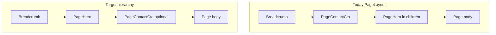

# Refactor inner-page chrome — CTA placement, width parity, visual hierarchy

## Overview

Recent changes added a **global WhatsApp + phone strip** (`PageContactCta`) to every `PageLayout` route and **widened** several templates from `max-w-3xl` to `max-w-6xl`. User feedback (reference screenshots: About `/sobre-nosotros`, Contact `/contacto`) indicates the **resulting hierarchy and density are worse**, not better: redundant conversion controls, awkward vertical rhythm between chrome and `PageHero`, and **leftover narrow rails** (e.g. `max-w-prose` on About) that conflict with the stated goal of **contact-/home-like editorial width**.

This plan **does not prescribe final pixels**; it locks **decisions, blast radius, and verification** so an implementer (`ce:work` or human) can execute without re-debating layout philosophy.

## Problem Frame

- **User expectation:** Inner marketing pages should feel like **one system**: same horizontal rail as `/contacto` and `PageHero` (`max-w-6xl` + shared `px-6 sm:px-12 lg:px-24`), with **clear reading order** and **no noisy duplicate CTAs**.
- **Current pain (inferred from code + complaint):**
  1. **`PageLayout` order** is `Breadcrumb` → **`PageContactCta`** → **page children** (which start with `PageHero`). The strip **sits above the page hero**, so on About/Contact the **primary headline is not first**; the green block competes with the hero typographic stack.
  2. **`/contacto`** already surfaces WhatsApp, hours, map, and a form. A **second** full split control **above** the hero is likely **redundant** and reads as heavy-handed.
  3. **`/sobre-nosotros`** uses a **12-column grid** inside `max-w-6xl`, but the main copy column still wraps content in **`max-w-prose`**, so the narrative column **remains visually narrow** compared to the contact two-column block — undermining the “wide like contact” intent.
  4. **`LeadCaptureSection`** keeps the form in **`max-w-xl`**, which is intentional for field width, but after widening body copy the **form island may look disproportionately small** unless spacing and alignment are reviewed.

## Requirements Trace

- **R1. Hierarchy:** On routes using `PageHero`, the **hero eyebrow + H1 + lede** must read as the **primary focal band** immediately after wayfinding (breadcrumb), unless a deliberate product decision places a single global CTA above it (decision in Key Technical Decisions).
- **R2. Width parity:** Shell width for **breadcrumb, optional CTA region, and `PageHero`** must stay on the **`max-w-6xl mx-auto` rail** with the same horizontal padding tokens used today (`PageBreadcrumb`, `PageHero`, contact grid).
- **R3. Redundancy:** On **`/contacto`**, users must not see **two competing** prominent WhatsApp + phone modules in the first viewport without rationale (strip vs sidebar).
- **R4. About page:** Main editorial column must **not** be capped at `max-w-prose` if the agreed direction is **full column width** within `lg:col-span-7`; if long lines are a concern, cap at an **explicit wider measure** (e.g. `max-w-4xl` / `max-w-5xl`) documented in `DESIGN.md`, not orphan `prose` in one page only.
- **R5. i18n & data:** No hardcoded phone or copy; reuse `business.contact` / `displayContact` / message namespaces (`Nav`, `PageLayout`, page-specific JSON).
- **R6. A11y:** Preserve focus rings, `aria-label`s on CTA group, semantic order (`nav` breadcrumb, then landmarks).
- **R7. Analytics:** Keep `track('contact_whatsapp')` / `track('contact_phone')` on interactive CTAs that remain in the DOM.

## Scope Boundaries

- **In scope:** `PageLayout` composition, `PageContactCta` placement/visibility rules, `PageHero` spacing adjacency, `sobre-nosotros` column measure, `contacto` redundancy, documentation in `DESIGN.md` / `AGENTS.md`, targeted Playwright coverage.
- **Out of scope:** Home `HomePage` hero (different layout shell), redesign of `Navigation` / `SiteFooter`, changing business phone numbers, new dependencies, service-detail hero image ratios, 3D/motion.
- **Non-goal:** Reintroducing per-route `breadcrumbAlign` / `prose` rails unless a future brief explicitly requires asymmetric editorial layouts.

## Context & Research

### Relevant Code and Patterns

| File | Role |
|------|------|
| `src/components/layout/PageLayout.tsx` | Mount order: `PageBreadcrumb` → `PageContactCta` → `children`. Props: `showContactCta`. |
| `src/components/layout/PageContactCta.tsx` | Client component; split WhatsApp + `tel:` control; `max-w-6xl` rail. |
| `src/components/layout/PageBreadcrumb.tsx` | `max-w-6xl mx-auto` + padding. |
| `src/components/layout/PageHero.tsx` | `max-w-6xl` hero stack; lede `max-w-2xl`. |
| `src/app/[locale]/contacto/page.tsx` | `PageHero` + `max-w-6xl` two-column grid; sidebar duplicates WhatsApp. |
| `src/app/[locale]/sobre-nosotros/page.tsx` | `max-w-6xl` grid `lg:grid-cols-12`; **main column `max-w-prose`** (likely user-visible mismatch). |
| `src/components/lead/LeadCaptureSection.tsx` | Embedded quote; `max-w-xl` form container. |
| `src/components/home/HomePage.tsx` | Reference for hero CTA cluster styling (split control). |

### Institutional Learnings

- No dedicated `docs/solutions/` entry for layout chrome; **`DESIGN.md` §7** max-width row was recently updated toward `max-w-6xl` as primary rail — implementation must stay consistent with that doc after changes.

### External References

- None required; layout and Next.js App Router patterns are established locally.

## Key Technical Decisions

| Decision | Rationale |
|----------|-----------|
| **D1 — Move `PageContactCta` below `PageHero` globally OR make placement configurable** | Today’s order buries the hero beneath a loud utility strip. Moving the strip **after** `PageHero` requires **composition change**: `PageLayout` cannot insert CTA between breadcrumb and children without splitting every page into fragments — so **prefer**: (a) **`PageLayout` accepts optional `hero` slot** vs `body`, or (b) **each page wraps** `PageHero` outside `PageLayout` (duplicates chrome), or (c) **CTA moves inside `PageHero` as optional prop** (centralizes hierarchy). **Recommended for minimal blast radius:** **`PageLayout` children stay as-is; add prop `contactCtaPlacement: 'after-hero' | 'below-breadcrumb'`** defaulting to **`below-breadcrumb`** only long enough to migrate — target end state **`after-hero`** implemented by **lifting `PageHero` into `PageLayout`** via composable slots or a wrapper component **`PageShell`** used by routes. *Implementation-time choice:* start with **`contactCtaPlacement`** on `PageLayout` with **`after-hero`** requiring the refactor described in Unit 1. |
| **D2 — `/contacto` sets `showContactCta={false}`** | Sidebar + form already satisfy R3; floating WhatsApp in nav/footer may still exist — confirm with visual pass. |
| **D3 — About column: remove `max-w-prose`; use `max-w-5xl` or none inside `lg:col-span-7`** | Balances R4 with readability; `max-w-5xl` (~64rem) is closer to contact grid column feel than `prose` (~65ch). |
| **D4 — Do not widen `LeadCaptureSection` form past `max-w-xl` without form UX review** | Input line length and tap targets; optional visual alignment via full-width section background is acceptable. |

### Resolved During Planning

- **Q:** Should CTA strip be removed entirely from some pages? **A:** At minimum **contact**; evaluate **about** after D1 (if hero-first reads cleanly, strip may stay).

### Deferred to Implementation

- Exact `pb/pt` token values between hero and CTA after move (depends on screenshot critique).
- Whether sticky mobile behavior is needed for CTA (not requested).

## High-Level Technical Design

> *This illustrates the intended approach and is directional guidance for review, not implementation specification.*



**Composable shell (directional):** Introduce a pattern where **`PageLayout` renders breadcrumb then either:**

- **`children` as a function `(slots) => ...`**, or
- **Subcomponents** `PageLayout.Hero` + `PageLayout.Body` **(cleaner):** pages migrate to:

```text
<PageLayout breadcrumb={...} showContactCta contactCtaAfterHero>
  <PageLayoutHero>...</PageLayoutHero>  // optional wrapper
  <PageLayoutMain>...</PageLayoutMain>
</PageLayout>
```

*Alternative with lower refactor cost:* keep single `children` blob but **move CTA into `PageHero` as optional `ctaSlot` prop* passed from each page — **rejected for duplication** across many pages; centralized shell preferred.

## Implementation Units

- [ ] **Unit 1: Restructure `PageLayout` to support hero-before-CTA ordering**

**Goal:** User sees **breadcrumb → PageHero → (optional) PageContactCta → rest of page** without copying layout code into every route.

**Requirements:** R1, R2, R6

**Dependencies:** None

**Files:**

- Modify: `src/components/layout/PageLayout.tsx`
- Modify: all consumers under `src/app/[locale]/` that use `PageLayout` + `PageHero` together (grep `PageLayout` + `PageHero` in same file)
- Test: `tests/e2e/page-chrome-hierarchy.spec.ts` (create)

**Approach:**

- Introduce a **documented composition API** (see High-Level Technical Design). Preferred: **two sibling slots** passed as props `hero: ReactNode` and `children: ReactNode` **or** explicit subcomponents exported from `PageLayout.tsx`.
- Render order inside `PageLayout`: scripts → `Navigation` → top spacer → `PageBreadcrumb` → **`hero`** → **conditional `PageContactCta` when `contactCtaAfterHero`** → **`children`** → `SiteFooter`.
- Migration: For each page that currently does `<PageLayout> <PageHero/> ...`, **lift `PageHero` into the `hero` prop** (or first slot). Pages without `PageHero` (e.g. service detail with custom top image) pass `hero={null}` or omit.
- **Backward compatibility:** If a single `children` API must stay, add **temporary** flag `contactCtaAfterHero` that **does not change order** until migration — *better to bite off full migration in one PR to avoid inconsistent states.*

**Patterns to follow:**

- Existing padding on `PageHero` (`px-6 sm:px-12 lg:px-24`) — ensure **no double padding** between `PageLayout` wrapper and `PageHero`.

**Test scenarios:**

- **Happy path:** Visit `/sobre-nosotros` and `/contacto` — **first heading in main content** after breadcrumb is the **page H1** (accessibility tree order); `PageContactCta` links appear **after** H1 in DOM order when strip is enabled.
- **Edge case:** Page with **no** `PageHero` (if any) — layout still renders; CTA position matches agreed default.
- **Integration:** With `showContactCta={false}`, **no** `PageContactCta` in DOM (or not visible—pick one consistent pattern).

**Verification:**

- Manual: compare to reference screenshots at 1440px and 390px width; hero legible above fold.

---

- [ ] **Unit 2: Remove or reduce conversion redundancy on `/contacto`**

**Goal:** Satisfy R3 — one clear primary path (form + sidebar), optional secondary in nav/footer.

**Requirements:** R3, R5, R7

**Dependencies:** Unit 1 (if CTA order changes), or can ship independently if only `showContactCta={false}`

**Files:**

- Modify: `src/app/[locale]/contacto/page.tsx`
- Test: `tests/e2e/page-chrome-hierarchy.spec.ts`

**Approach:**

- Set **`showContactCta={false}`** on `PageLayout` for contact route **or** replace strip with **minimal text link row** (only if stakeholder wants *some* duplication).
- Confirm **Navigation** / floating WhatsApp still provides mobile escape hatch.

**Test scenarios:**

- **Happy path:** `/contacto` loads 200; **assert count** of visible elements with `href` containing `wa.me` **in main landmark** ≤ 1 (sidebar link) after change — adjust assertion to match final design.

**Verification:**

- No layout shift regression on LCP hero text (contact uses `PageHero` only, no large image).

---

- [ ] **Unit 3: Harmonize `/sobre-nosotros` main column measure**

**Goal:** R4 — column width feels consistent with contact editorial grid, not a narrow prose island.

**Requirements:** R4, R2

**Dependencies:** None (can parallel Unit 2)

**Files:**

- Modify: `src/app/[locale]/sobre-nosotros/page.tsx`
- Modify: `DESIGN.md` (max-width note if new canonical measure is `max-w-5xl` for longform-in-grid)
- Test: `tests/e2e/page-chrome-hierarchy.spec.ts` (optional: snapshot or bounding box smoke)

**Approach:**

- **Remove `max-w-prose`** wrapper or replace with **`max-w-5xl`** / **`max-w-none`** per `DESIGN.md` update.
- Ensure **`LeadCaptureSection`** alignment: full width of `lg:col-span-7` or intentional indent documented.

**Test scenarios:**

- **Happy path:** About page main column **computed width** at `lg` ≥ **X%** of `max-w-6xl` container (implementation defines X — e.g. col span 7/12 minus gap).
- **Edge case:** Mobile single column — text remains readable (no accidental overflow).

**Verification:**

- Side-by-side browser tab: About vs Contact — **visual width** of primary text block feels in family.

---

- [ ] **Unit 4: Spacing tokens between chrome regions**

**Goal:** After reordering, **vertical rhythm** matches automotive-premium restraint (`DESIGN.md`).

**Requirements:** R1, R2

**Dependencies:** Unit 1

**Files:**

- Modify: `src/components/layout/PageContactCta.tsx` (top/bottom padding, border treatment)
- Modify: `src/components/layout/PageHero.tsx` (optional bottom padding reduction if CTA abuts)

**Approach:**

- Reduce **double border** (`border-t` on CTA + `PageHero` bottom padding) if it creates a **thick seam**.
- Consider **one** hairline separator *either* under hero *or* above CTA, not both.

**Test scenarios:**

- **Happy path:** No overlapping sticky `top-28` aside on About with new CTA position (scroll test manual).

**Verification:**

- Screenshot diff optional; at minimum DevTools layout inspection.

---

- [ ] **Unit 5: Documentation + route table accuracy**

**Goal:** Future agents do not reintroduce `max-w-prose` on full-width marketing columns without intent.

**Requirements:** R4 (documentation)

**Dependencies:** Units 1–3

**Files:**

- Modify: `DESIGN.md` §7 (max width / hierarchy note)
- Modify: `AGENTS.md` **App routes** section — clarify **`PageLayout` chrome order** after refactor

**Test scenarios:**

- **Test expectation:** none — documentation only.

**Verification:**

- Peer read for contradicting statements vs code.

---

- [ ] **Unit 6: Playwright regression suite for chrome hierarchy**

**Goal:** Encode R1/R3 as automated smoke.

**Requirements:** R1, R3, R6

**Dependencies:** Units 1–2 minimum

**Files:**

- Create: `tests/e2e/page-chrome-hierarchy.spec.ts`

**Approach:**

- For `/es/sobre-nosotros` and `/es/contacto` (and `/en/...` equivalents):
  - **DOM order:** `main h1` or `PageHero` heading appears **before** `PageContactCta` **group** `aria-label` when CTA is present.
  - **Contact:** assert strip absent or deprioritized per Unit 2 decision.
- Reuse `playwright.config` baseURL from existing e2e tests.

**Test scenarios:**

- **Happy path:** Order assertion passes on both locales.
- **Edge case:** JS-enabled hydration — wait for `networkidle` or `locator` visible for client `PageContactCta`.

**Verification:**

- `npx playwright test tests/e2e/page-chrome-hierarchy.spec.ts` green locally and in CI if configured.

## System-Wide Impact

| Surface | Impact |
|---------|--------|
| **All `PageLayout` routes** | DOM order and possibly CTA visibility change — review **servicios index/detail**, **guias**, **FAQ**, **garantía**, **zonas**. |
| **SEO / accessibility** | DOM order affects screen reader experience positively if hero precedes CTA. |
| **Analytics** | Fewer impressions of `contact_whatsapp` from global strip on contact; nav/footer may compensate — flag to stakeholder. |
| **Sticky aside (About)** | `lg:sticky lg:top-28` may need offset tweak if header + CTA height changes. |

**Unchanged invariants:** `business.contact` values, API routes, JSON-LD breadcrumb generation, `next-intl` namespaces (except if new strings for optional slim CTA).

## Risks & Dependencies

| Risk | Mitigation |
|------|-----------|
| Large **multi-file migration** for Unit 1 | Single PR; grep all `PageLayout` usages; typecheck gates. |
| **Visual regression** on guide pages | Manual pass on longest guide + service detail. |
| **Playwright flakiness** | Use stable `getByRole` / `aria-label` from `PageLayout.contactCta` messages. |

## Documentation / Operational Notes

- After merge: capture **before/after screenshots** for About + Contact in PR description (user requested visual proof earlier in project history).

## Sources & References

- **Origin document:** none (user report + screenshots `Screenshot From 2026-04-28 19-43-46.png`, `19-44-16.png`, `19-44-45.png` — local paths on author machine).
- Related code: `src/components/layout/PageLayout.tsx`, `src/app/[locale]/sobre-nosotros/page.tsx`, `src/app/[locale]/contacto/page.tsx`
- Prior plan corpus: `docs/plans/2026-04-24-001-feat-locale-seo-hardening-plan.md` (unrelated; no conflict expected).

---

## Confidence check (planning-time)

**Strengthening: Implementation Units + Key Technical Decisions** — rationale for **hero-before-CTA** and **`PageLayout` API refactor** spelled out; without this, implementers might patch only `/contacto` and leave systemic order bug.

**Strengthening: System-Wide Impact** — explicit list of affected routes and sticky aside risk.

*Note: `document-review` skill pass and external subagents (`compound-engineering:*`) were not run in this session — run `document-review` on this file in tooling that supports it if P0/P1 coherence review is required.*

## Handoff — execution

This artifact is **plan-only** per `/ce-plan`. **Do not implement in the same turn as plan generation** without a separate execution pass.

**Suggested next step:** `/ce:work` with `docs/plans/2026-04-28-001-refactor-page-chrome-hierarchy-plan.md`, or manual implementation following Units 1→6 in order (Unit 6 can trail Unit 1–2 by one commit if needed).

**Regarding "multi-agent specialized execution":** The repo’s agent docs reference specialized reviewers (`design-implementation-reviewer`, `performance-oracle`, etc. in `CLAUDE.md`). After implementation, run **design-implementation-reviewer** against `DESIGN.md` and **accessibility** for DOM order change — not during planning.
